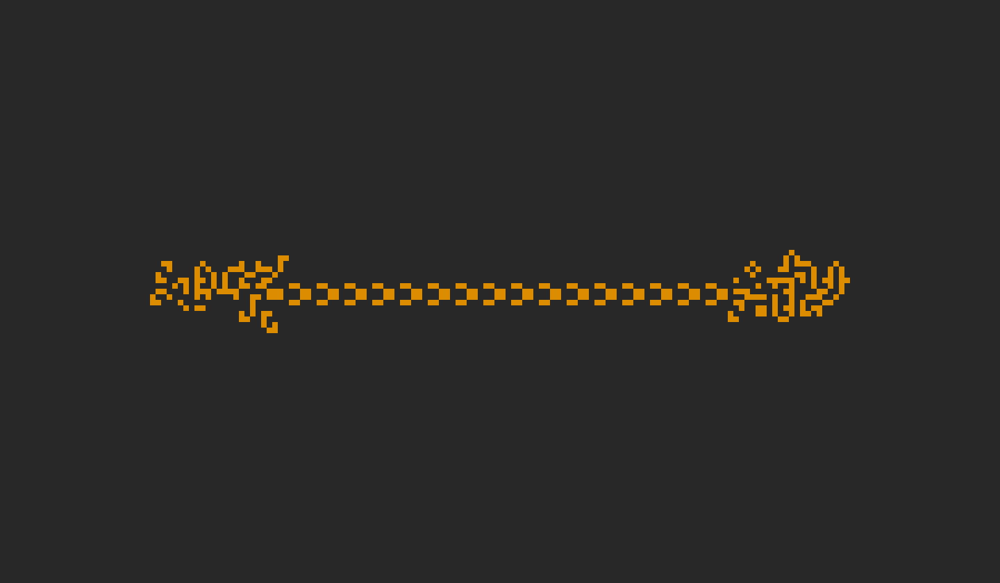
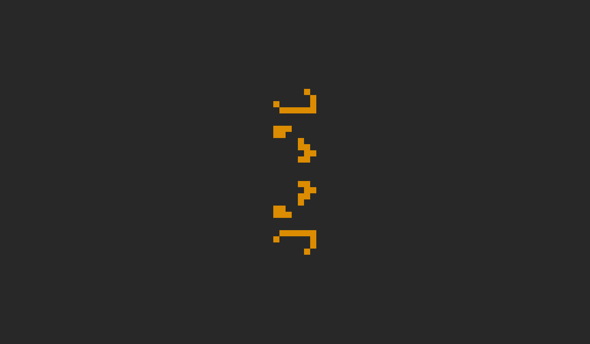
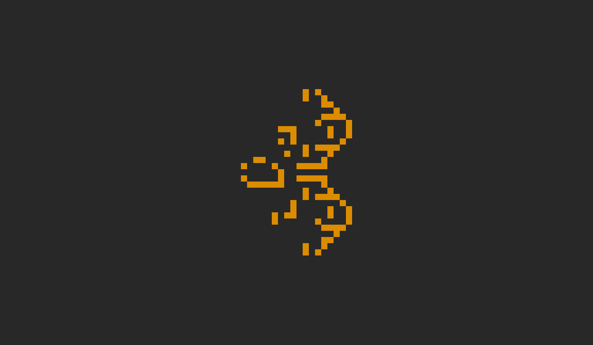
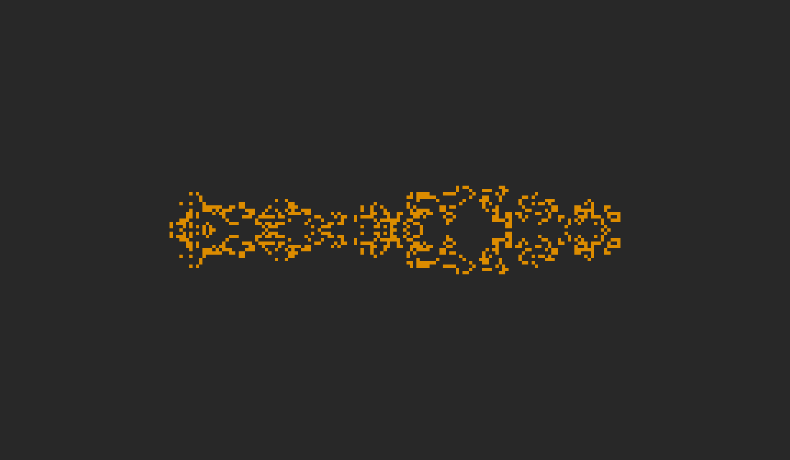
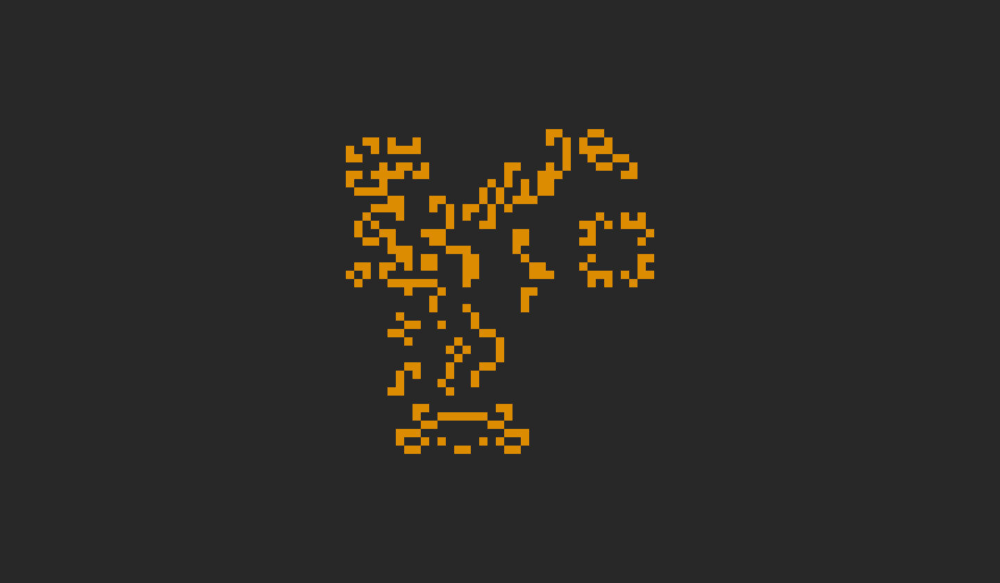

## An implementation of [Conway's Game of Life](https://en.wikipedia.org/wiki/Conway%27s_Game_of_Life) on a dynamic infinite grid

<h3 align="center">Some cool patterns</h3>

<strong>Methuselahs:</strong> small starting patterns that stabilise after many generations

	<em>R-pentomino</em>
	 
	
	<em>Cross 1</em>
	 
	
	<em>Cross 2</em>
	 
	

<strong>Oscillators:</strong> patterns that cycle through a fixed sequence of states without moving

	<em>Achim's other P16</em>
	 
	
	<em>Beluchenko's P51</em>
	 
	
	<em>Electric fence</em>
	 
	
	<em>Snark</em>
	 
	
	<em>P200 traffic jam</em>
	 
	

<strong>Spaceships:</strong> patterns that translate themselves across the grid while repeating their shape

	<em>Basic spaceships (lightweight spaceship, middleweight spaceship, heavyweight spaceship)</em>
	 
	
	<em>Puffer</em>
	 
	
	<em>Backrake (emits gliders)</em>
	 
	
	<em>Spaghetti monster</em>
	 
	
	<em>Against-the-grain greyship</em>
	 
	

<strong>Guns:</strong> patterns that periodically emit spaceships

	<em>Gosper glider gun</em>
	 
	
	<em>P24 gliderless LWSS gun</em>
	 
	
	<em>P58 LWSS gun</em>
	 
	
	<em>P44 MWSS gun</em>
	 
	
	<em>Small P120 HWSS gun</em>
	 
	
	<em>Gunstar 2</em>
	 
	

<strong>Breeders:</strong> patterns that grow by creating an unbounded number of infinitely growing patterns

	<em>Breeder 1 (produces Gosper glider guns)</em>
	 
	

Sources for preset patterns:
- https://conwaylife.appspot.com/library/
- https://conwaylife.com/wiki/
- https://conwaylife.com/patterns/
