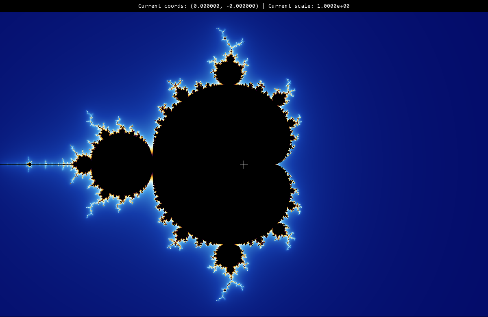
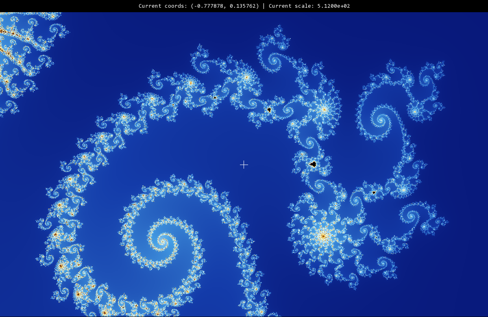
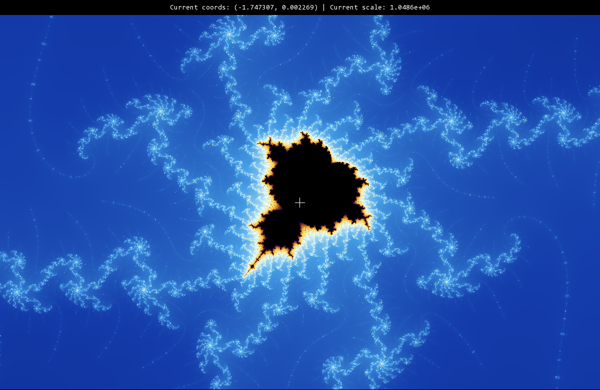
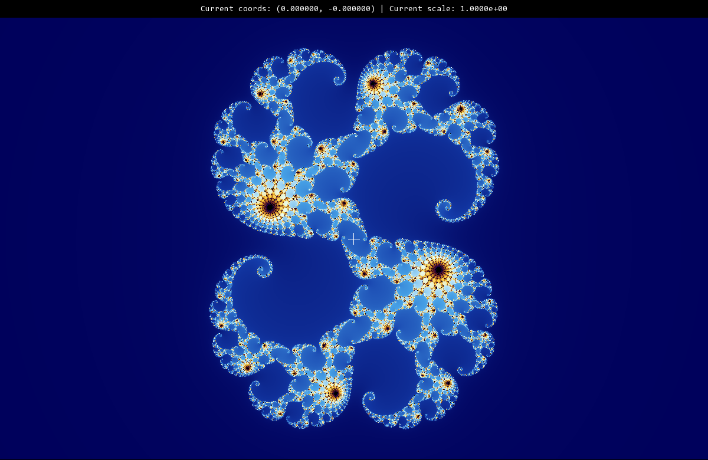

## Mandelbrot/Julia Set visualiser

<h3 align="center">Iterative definition</h3>

The Mandelbrot set is defined as the set of all complex numbers $c$ for which the function:

$$z = z^2 + c$$

does not diverge when iterated (starting at the origin, $z_0 = 0 + 0\mathbf{i}$). I.e., $c$ belongs to the Mandelbrot set if the sequence remains bounded.

Julia sets are defined by the same function:

$$z = z^2 + c$$

but here, $c$ is fixed, and the initial value $z_0$ varies. Similarly, a point $z_0$ belongs to the Julia set for a given $c$ if the sequence remains bounded.

<h3 align="center">Examples of different coordinates/zoom levels on the Mandelbrot set</h3>

	
	 
	
	 
	

<h3 align="center">Examples of Julia sets for different values of $c$</h3>

$c = 0.28 + 0.008\mathbf{i}$

	

$c$ linearly interpolated from $-0.8 + 0.16\mathbf{i}$ to $-0.75 + 0.11\mathbf{i}$

	

$c = 0.77e^{a\mathbf{i}}$, varying $a$ from $0$ to $2\pi$:

	

Source:
- [Plotting algorithms for the Mandelbrot set](https://en.wikipedia.org/wiki/Plotting_algorithms_for_the_Mandelbrot_set)
