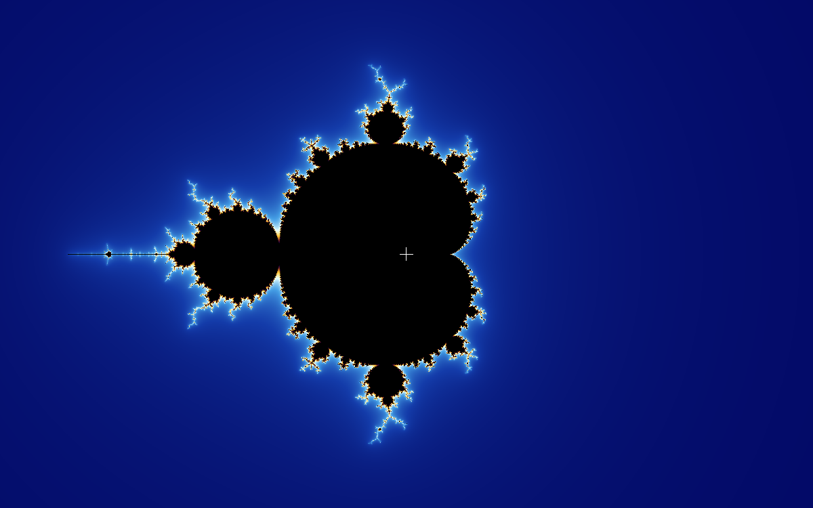
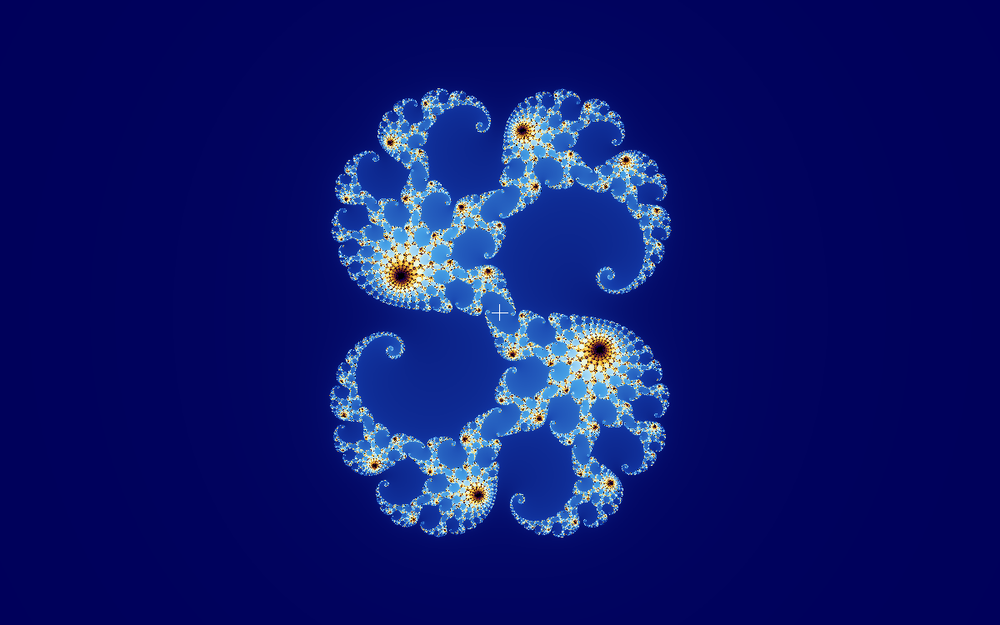

## [Mandelbrot set](https://en.wikipedia.org/wiki/Mandelbrot_set)/[Julia set](https://en.wikipedia.org/wiki/Julia_set) visualiser

<h3 align="center">Iterative definition</h3>

The Mandelbrot set is defined as the set of all complex numbers $c$ for which the function:

$$z = z^2 + c$$

does not diverge when iterated (starting at the origin, $z_0 = 0 + 0\mathbf{i}$). I.e., $c$ belongs to the Mandelbrot set if the sequence remains bounded.

Julia sets are defined by the same function:

$$z = z^2 + c$$

but here, $c$ is fixed, and the initial value $z_0$ varies. Similarly, a point $z_0$ belongs to the Julia set for a given $c$ if the sequence remains bounded.

<h3 align="center">Some cool zooms into the Mandelbrot set</h3>

Origin ($0 + 0\mathbf{i}$) (no magnification)

	

$-0.74453952 + 0.12172412\mathbf{i}$ ($50,000 \times$ magnification)

	

$0.360147036 + 0.641212176\mathbf{i}$ ($10^6 \times$ magnification)

	

$-1.479892325756 + 0.00063343092\mathbf{i}$ ($10^{9} \times$ magnification)

	

$-0.77468056281905 - 0.13741669895407\mathbf{i}$ ($10^{12} \times$ magnification)

	

<h3 align="center">Examples of Julia sets for different values of $c$</h3>

$c = 0.28 + 0.008\mathbf{i}$

	

$c = 0.77e^{a\mathbf{i}}$, varying $a$ from $0$ to $2\pi$:

	

Source:
- [Plotting algorithms for the Mandelbrot set](https://en.wikipedia.org/wiki/Plotting_algorithms_for_the_Mandelbrot_set)
