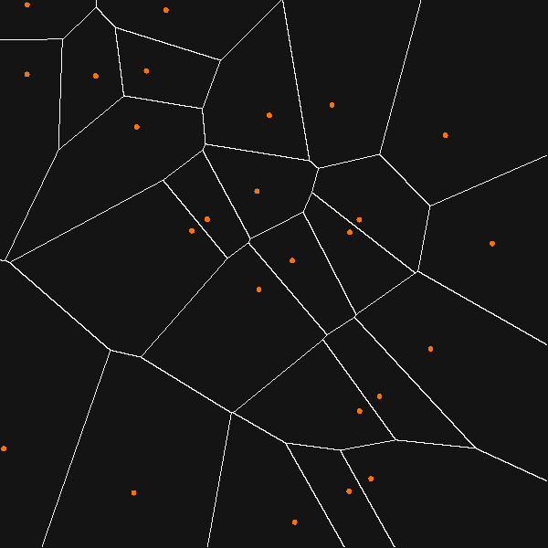
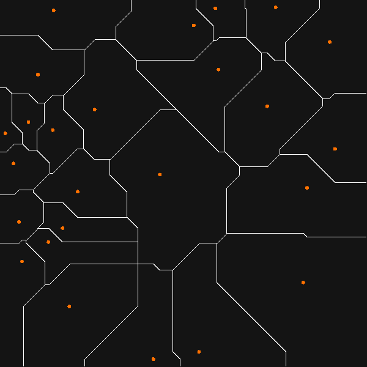
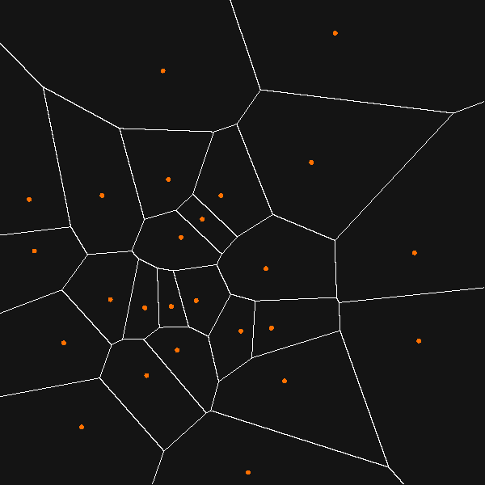

## Moving [Voronoi diagram](https://en.wikipedia.org/wiki/Voronoi_diagram) generator with [Lloyd's algorithm](https://en.wikipedia.org/wiki/Lloyd%27s_algorithm)

Euclidean distance:

	

Manhattan distance:

	

Lloyd's algorithm:

	

