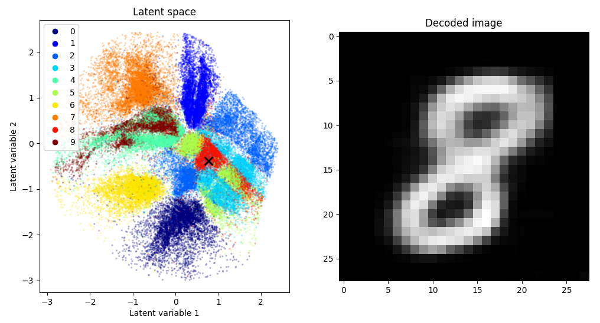
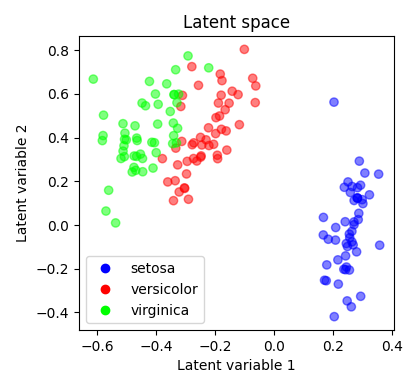
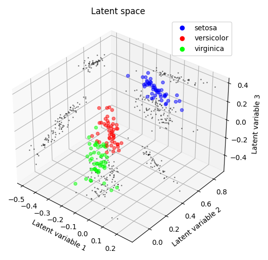

PyTorch autoencoder demo for the MNIST dataset or for tabular data such as the iris dataset.

In the case of the MNIST autoencoder, the data dimensionality is reduced from `(1, 28, 28)` (colour channels, width, height) to `(2,)` - a compression factor of 392. These latent variables can thus be plotted on $xy$ axes:

MNIST autoencoder architecture:

Example of tabular data compression (iris dataset, 2 latent variables and 3 latent variables):

