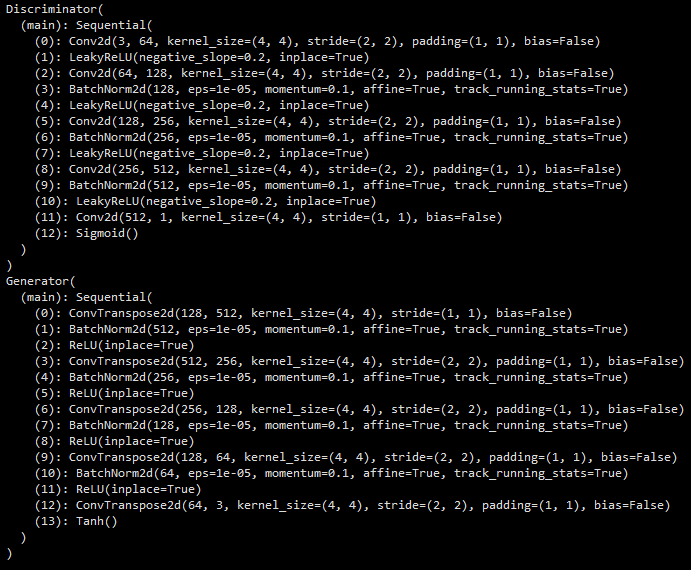

PyTorch demo of a Deep Convolutional Generative Adversarial Network (DCGAN)

Training progress on a fixed noise vector:

Visualising some of the latent space by linearly interpolating between 2 random noise vectors:

Model architectures:

