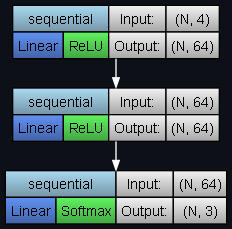

Script for plotting PyTorch models as Graphviz graphs

Example uses:

```
model = torch.nn.Sequential(
    torch.nn.Linear(4, 64),
    torch.nn.ReLU(),
    torch.nn.Linear(64, 64),
    torch.nn.ReLU(),
    torch.nn.Linear(64, 3),
    torch.nn.Softmax(dim=-1)
)
plot_model(model, (4,))
```



```
model = load_model_from_py(file_path='path/to/mnist_model.py', model_class_name='CNN')
plot_model(model, (1, 28, 28))
```


