## Adversarial Attacks on Pretrained ResNet18

This demo illustrates how classification models can be fooled via adversarial patches and perturbations (noise). A ResNet18 classifier pretrained on ImageNet is used as the target model.

- Patch: a localised artefact (e.g. a 32x32 pixel square) inserted into an image that can cause misclassification.
- Perturbation: a small (often imperceptible) amount of noise added across all pixels in an image that can cause misclassification. Here, we train Universal Adversarial Perturbations (UAPs) that are shared across many images, rather than being image-specific.
- Untargeted attack objective: maximise the model's loss on the true label (i.e. negate cross-entropy loss), forcing the model to make any incorrect prediction.
- Targeted attack objective: minimise the model's loss on the target label, forcing the model to predict a specific class.

For targeted adversarial patches / perturbations, this subset of ImageNet classes is used: `acoustic_guitar`, `analog_clock`, `espresso`, `giant_panda`, `goldfish`, `koala`, `lemon`, `starfish`, `tiger`, `toaster` and `violin`.

Below are the learned patches (inc. untargeted). Note how the targeted ones resemble their respective class.

	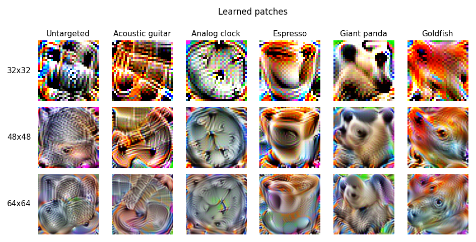
	 
	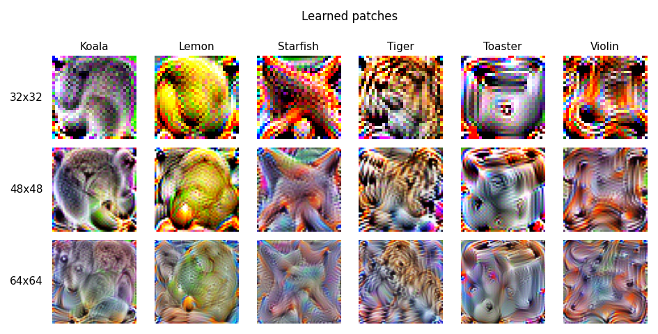

Baseline model performance (clean test set samples, no adversarial attack):

	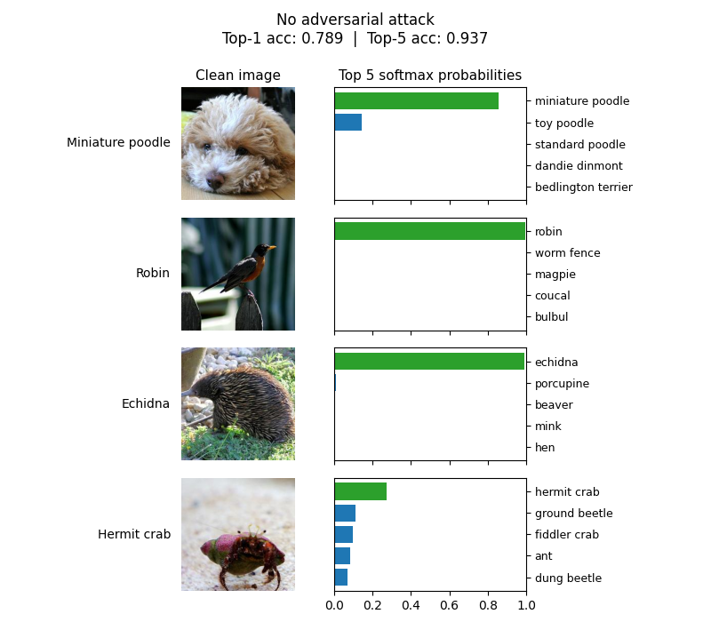
	 
	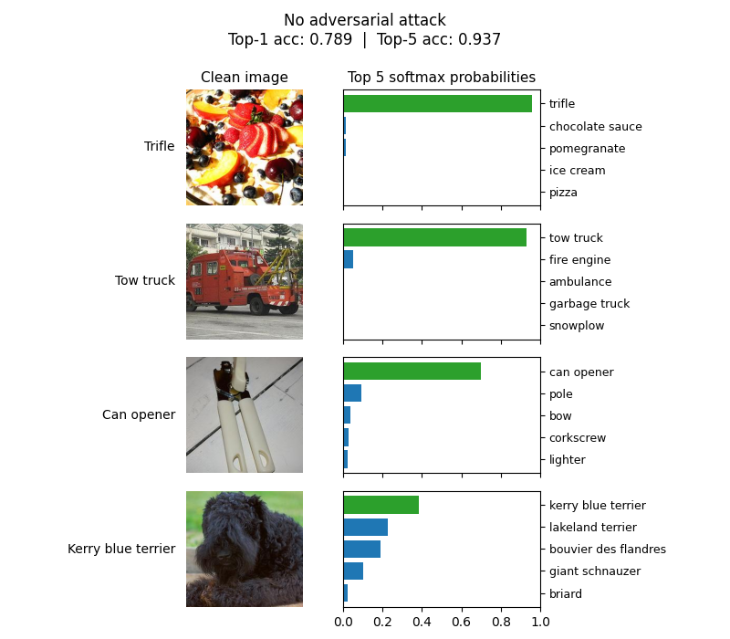

Some patches in action:

	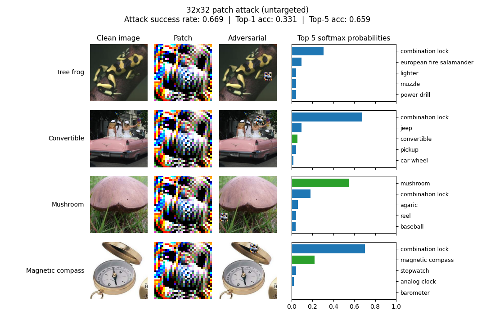
	 
	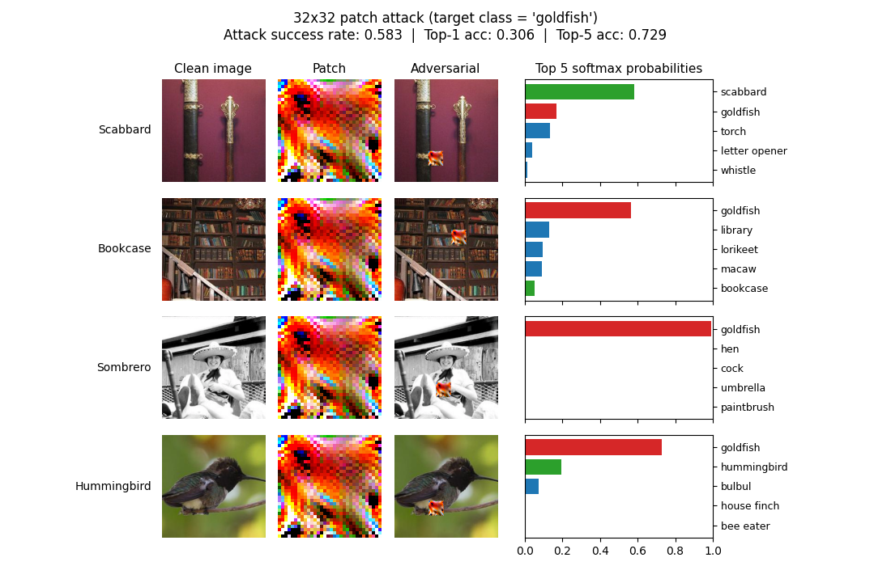
	 
	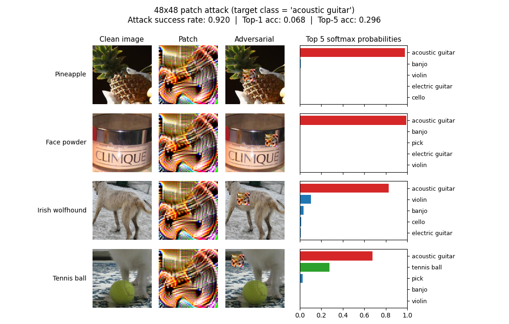
	 
	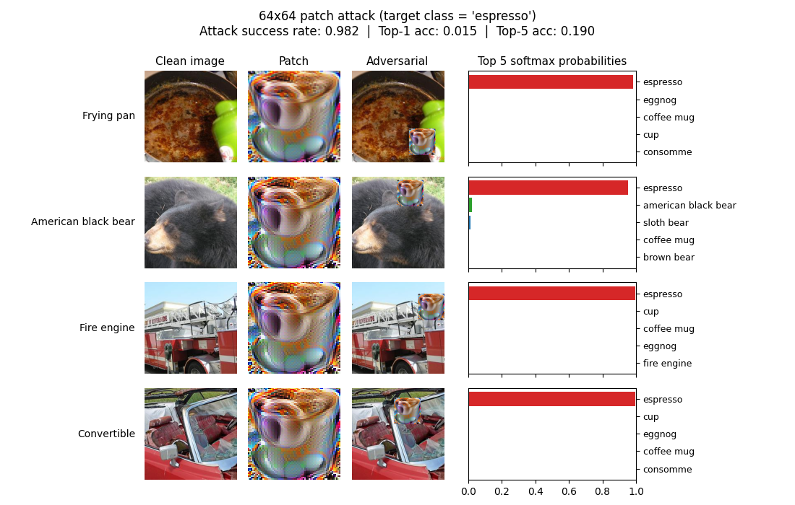

Some perturbations in action:

	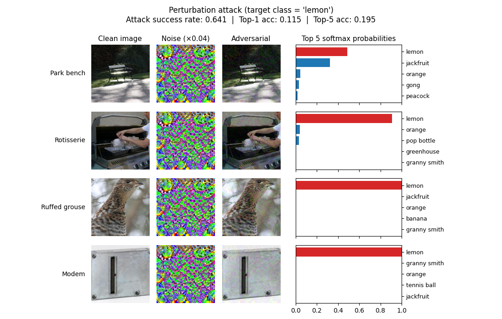
	 
	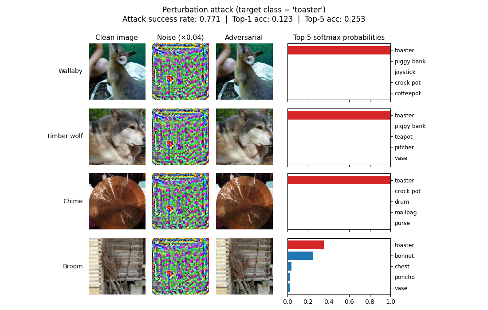
	 
	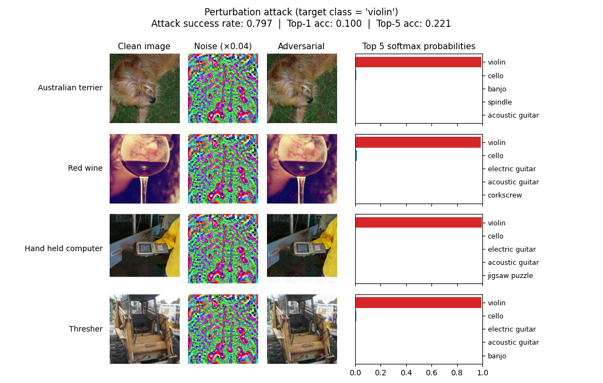

Sources:
- [Tutorial 10: Adversarial attacks](https://uvadlc-notebooks.readthedocs.io/en/latest/tutorial_notebooks/tutorial10/Adversarial_Attacks.html) (University of Amsterdam Deep Learning Course)
- [Towards Evaluating the Robustness of Neural Networks](https://arxiv.org/pdf/1608.04644) (Carlini, Wagner 2016)
- [Universal Adversarial Perturbations](https://arxiv.org/pdf/1610.08401) (Moosavi-Dezfooli et. al. 2016)
- [ImageNet 256x256](https://www.kaggle.com/datasets/dimensi0n/imagenet-256) (Kaggle dataset)
