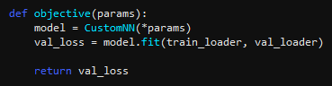
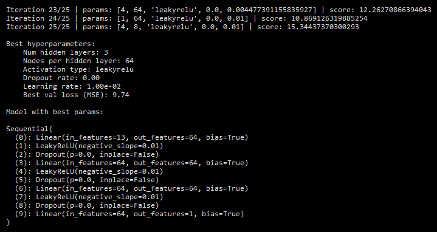
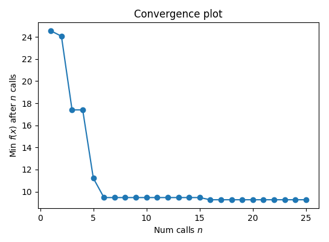

## Bayesian Hyperparameter Optimisation demo (on Boston housing dataset)

Given this objective function $f(x)$ (where $x$ in this case is the set of model parameters):

	

and this search space:

	

use Bayesian optimisation to find the best set of hyperparameters for the neural net (those which minimise the objective).

The objective is treated as a [black box](https://en.wikipedia.org/wiki/Black_box). Bayesian optimisation uses a [Gaussian process](https://en.wikipedia.org/wiki/Gaussian_process) to model this function: the Gaussian process serves as a [surrogate model](https://en.wikipedia.org/wiki/Surrogate_model), approximating the objective based on observed data points.

Output:

	

	

