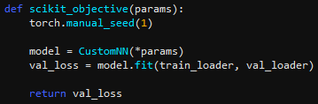
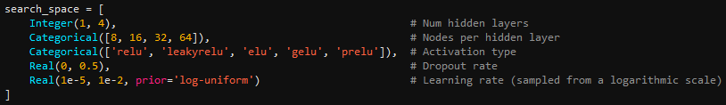
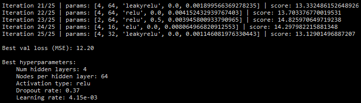
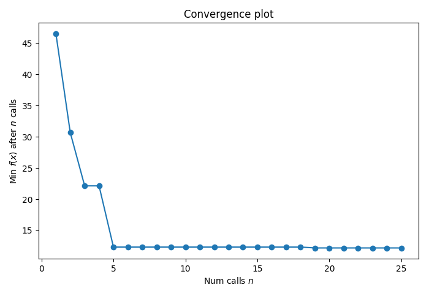
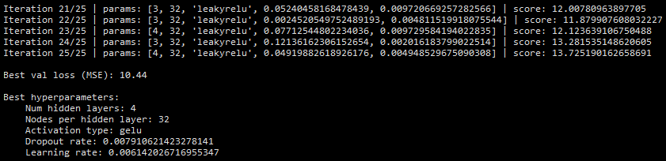
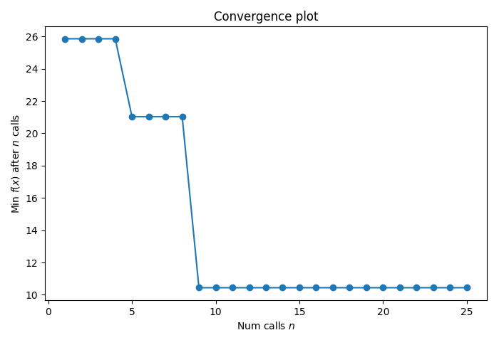

## Bayesian Hyperparameter Optimisation demo (on Boston housing dataset)

<h3 align="center">Scikit-optimize</h3>

Given this objective function $f(x)$ (where $x$ in this case is the set of neural network hyperparameters):

	

and this search space:

	

use Bayesian optimisation to find the set of neural net hyperparameters that minimises the objective (in this case, validation loss).

The objective is treated as a [black box](https://en.wikipedia.org/wiki/Black_box). The default optimiser (`gp_minimize`) in scikit-optimize uses a [Gaussian process](https://en.wikipedia.org/wiki/Gaussian_process) (GP) as a [surrogate model](https://en.wikipedia.org/wiki/Surrogate_model). The GP approximates the expensive objective function using previously evaluated hyperparameter configurations and their observed scores, allowing the optimiser to efficiently select promising regions of the search space.

Output:

	

	

<h3 align="center">Optuna</h3>

Optuna approaches Bayesian optimisation differently. By default, it uses a Tree-structured Parzen Estimator (TPE), which models promising and less promising regions of the search space separately based on previously evaluated trials.

These probabilistic surrogate models are then used to propose new hyperparameter configurations that are likely to improve the objective, balancing exploration of unexplored regions with exploitation of areas that have performed well.

Result (using the same search space):

	

	

