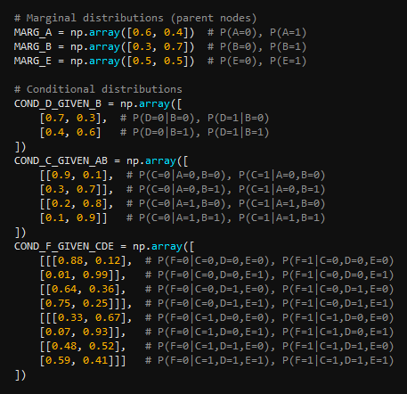
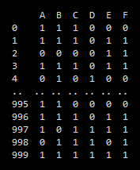

## Data Synthesis via a Bayesian Network

E.g. Given this graphical model (Bayes net):

	

and its distributions (marginal and conditional):

	

we can sample from these distributions to synthesise data:

	

