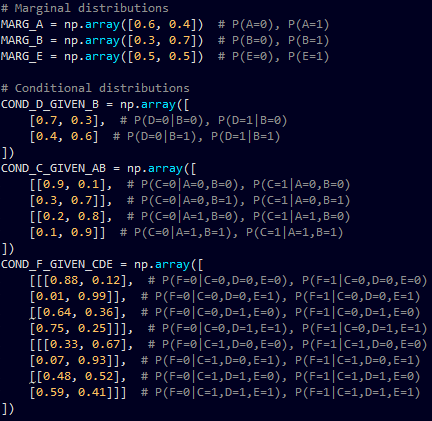
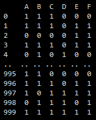

Demo of data synthesis from a Bayesian network

E.g. Given this graphical model (Bayes net):

and its distributions (marginal and conditional):

we can sample from these distributions to synthesise data:

