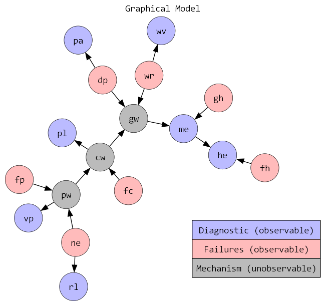
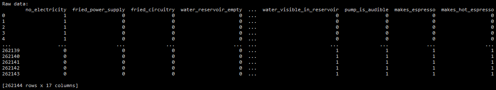
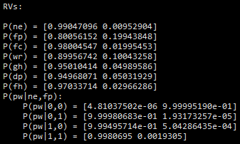
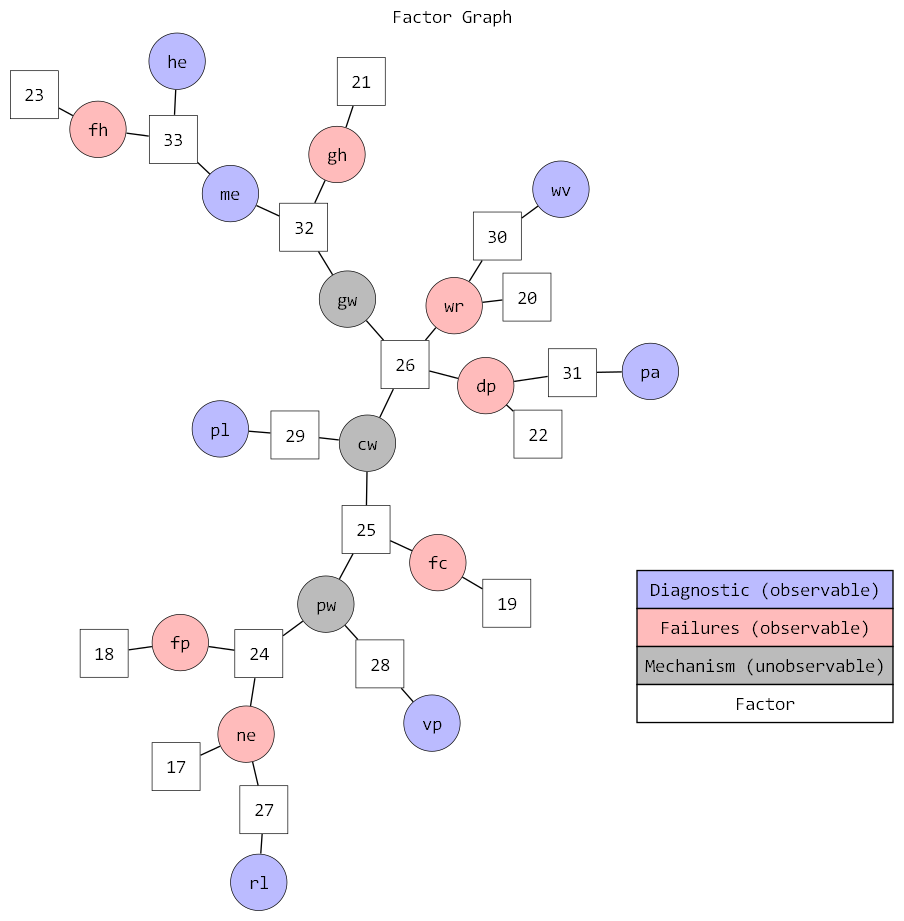
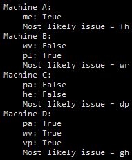

## Bayesian Network Belief Propagation demo

Based on this graphical model of a coffee machine:

	

Where e.g. `cw` &rarr; `pl` $= P(\text{pl|cw}) = P(\text{power light switches on | circuitry works})$

1. First, we calculate the distribution of the random variables (both marginal and conditional) given the raw observations:

	
	 
	

2. Next, we generate the factor graph which we'll use for message sending (Belief Propagation to calculate marginals given certain observations)

	

3. We then calculate the message order: a message can only be sent from node A to node B once A has received all of its messages, except for the message from B.

4. Finally, we use message passing to perform our Belief Propagation to calculate the marginals for some test machine observations:

	

