## Classification of brain tumour MRIs with a PyTorch Convolutional Neural Network (CNN)

	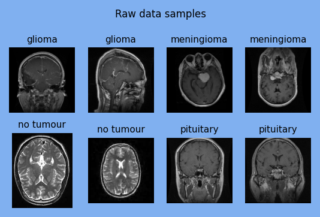
	 
	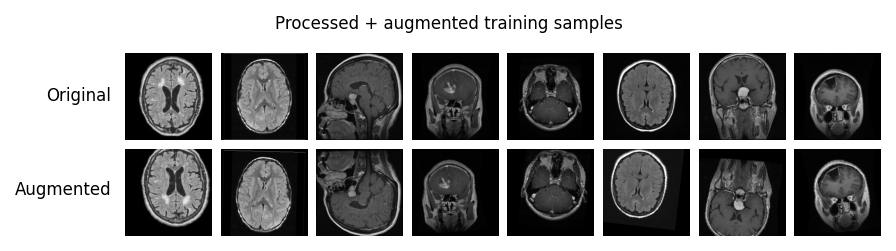

Test set performance:

	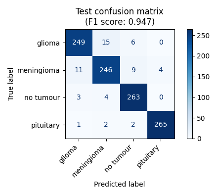

Saliency maps for some sample images:

	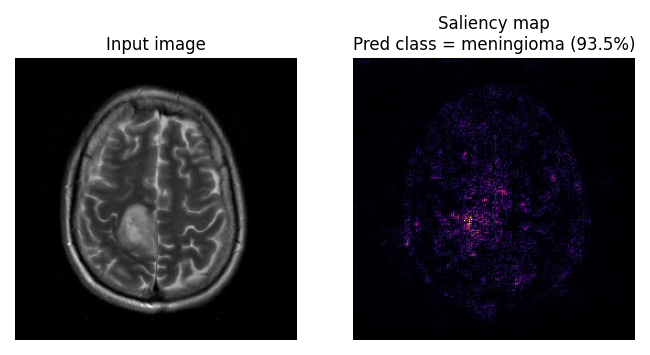
	 
	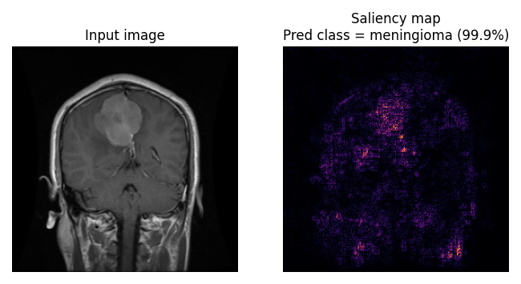
	 
	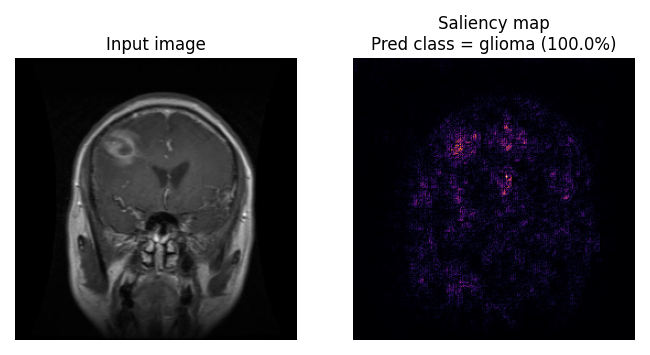

Learned filters of each conv layer, and corresponding feature maps of a sample image:

	
	 
	
	 
	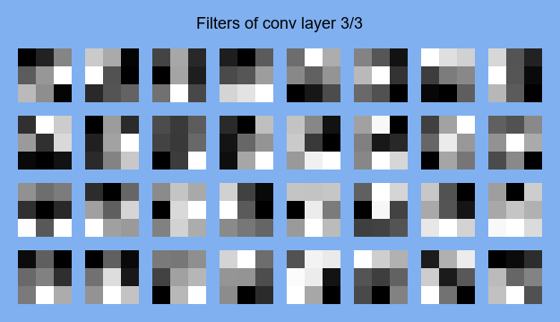
	 
	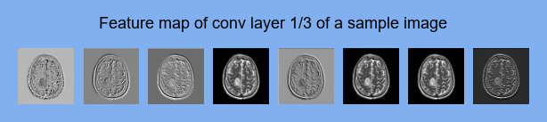
	 
	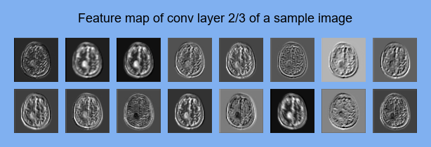
	 
	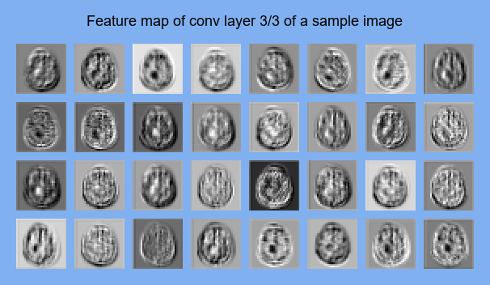

Model architecture:

	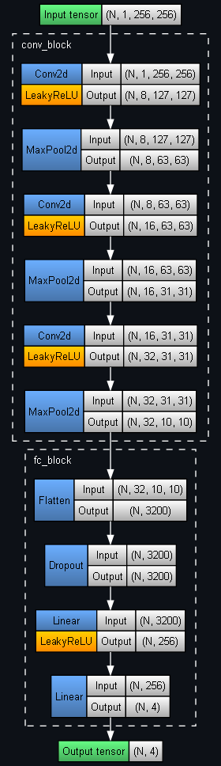

Source:
- [Brain Tumour MRIs](https://www.kaggle.com/datasets/masoudnickparvar/brain-tumor-mri-dataset) (Kaggle dataset)
