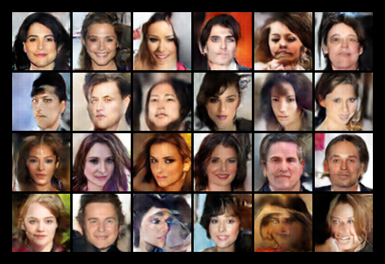
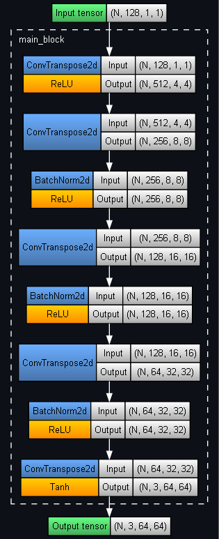
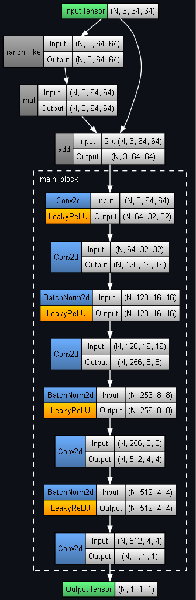

## PyTorch Deep Convolutional Generative Adversarial Network

This demo illustrates a Deep Convolutional Generative Adversarial Network (DCGAN) trained on a subset of the CelebA dataset (30k images of celebrity faces).

### Model Architecture

A GAN consists of two neural networks. The first is a generator, which takes a random latent vector $z$ and produces a synthetic image:

$$G(z) = x_\text{fake}$$

The other network is a discriminator, which takes an image $x$ and outputs a probability that it is real:

$$D(x) = P(\text{real}\space|\space x)$$

$D(x) \approx 1$ means likely real, $D(x) \approx 0$ means likely fake (generated).

### Training

The discriminator must learn to distinguish real and fake images, while the generator must learn to produce increasingly realistic samples that can fool the discriminator. The original GAN objective is defined as:

$$\min_{G}\max_{D} V(D,G)=\mathbb{E}_{x \sim p_{\text{data}}(x)}[\log D(x)] + \mathbb{E}_{z \sim p_z(z)}[\log (1-D(G(z)))]$$

- $V$ is the value function of the minimax game (the generator $G$ must minimise this; the discriminator $D$ must maximise it)
- $x \sim p_\text{data}$ is a real data sample
- $z \sim p_z$ is a latent noise vector.

Hence, the discriminator loss is:

$$L_D=-\mathbb{E}_x[\log D(x)] - \mathbb{E}_z[\log (1-D(G(z)))]$$

encouraging $D(x) \rightarrow 1$ for real images and $D(G(z)) \rightarrow 0$ for fake images.

In practice, the generator is typically trained using the non-saturating loss:

$$L_G=-\mathbb{E}_z[\log D(G(z))]$$

rather than minimising $\mathbb{E}_z[\log (1-D(G(z)))]$, as the non-saturating loss provides stronger gradients during training. This objective encourages the generator to produce images that the discriminator classifies as real, i.e. $D(G(z)) \rightarrow 1$.

### Outputs

Some generated face samples given a latent vector:

	

Visualising some of the latent space by linearly interpolating between 2 random vectors:

	

Generator architecture:

	

Discriminator architecture:

	

Sources:
- [Generative Adversarial Nets](https://arxiv.org/pdf/1406.2661) (Goodfellow et. al. 2014)
- [CelebA-HQ resized (256x256)](https://www.kaggle.com/datasets/badasstechie/celebahq-resized-256x256) (Kaggle dataset)
