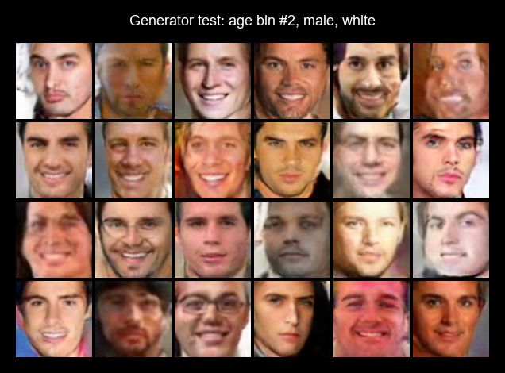
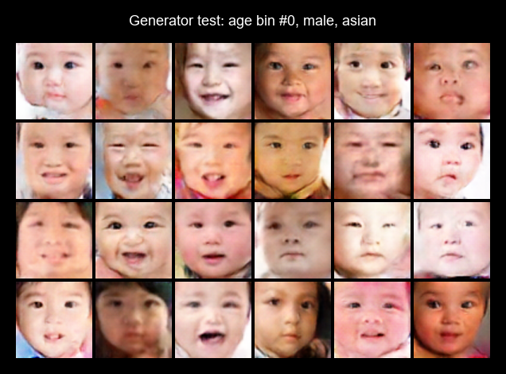
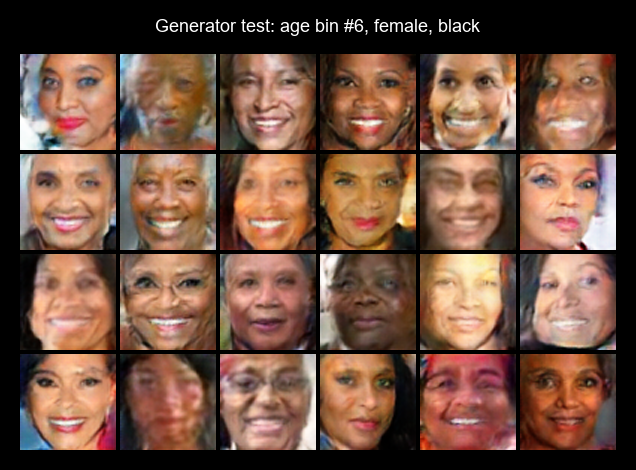

## PyTorch Conditional Generative Adversarial Network

This demo illustrates how a GAN can be conditioned on input attributes, allowing the generator to produce images with specific desired characteristics.

Unlike a standard GAN (see [this other project](../generative_adversarial_network)) which learns the distribution:

 $$P(\text{image})$$

a conditional GAN (cGAN) learns:

 $$P(\text{image | attributes})$$

This means that instead of generating completely random samples from the learned image distribution, we can control the generation process by providing additional attribute information.

### Dataset

Here, we use the UTKFace dataset, which contains over 20k face images labelled with:
- Age (approx. 1-100 years old) (we group ages into 10 bins)
- Gender (male/female)
- Race ('white', 'black', 'asian', 'indian', 'other').

Each image is associated with an attribute vector:

$$y = [\text{age bin}, \text{gender}, \text{race}]$$

which is provided as a condition to both the generator and discriminator.

### Model Architecture

Like a standard GAN, a cGAN consists of a generator network and a discriminator network. However, rather than just taking a random latent vector $z$ as input, the generator also takes a condition vector $y$ to produce a synthetic image:

$$G(z,y) = x_\text{fake}$$

The attributes $y$ are encoded into learned embeddings that are used to condition the image generation process (see `models.py` for more details).

Similarly, the discriminator also takes $y$ as input and outputs a real-valued compatibility score:

$$D(x,y) \in \mathbb{R}$$

Higher scores indicate that images are more likely to be real and matching the provided attributes, while lower scores indicate fake or mismatched samples. Unlike a standard GAN trained with binary cross-entropy (BCE), the discriminator does not estimate a probability.

### Training

The chosen objective here for training the discriminator is hinge loss:

$$L_D=\mathbb{E}[\max(0, 1-D(x,y))] + \mathbb{E}[\max(0, 1+D(G(z,y),y))]$$

rather than BCE, as BCE can produce vanishing gradients when the discriminator becomes very confident, leading to discriminator saturation and leaving weaker gradients for the generator. Hinge loss introduces a margin between real and fake samples: instead of forcing discriminator output towards fixed probabilities (0 and 1), it encourages $D(\cdot) \ge +1$ for real samples and $D(\cdot) \le -1$ for fake samples. Once the discriminator achieves this margin, the loss becomes zero, preventing excessive discriminator confidence and providing more stable gradients for generator training.

### Outputs

By changing the condition vector, we can control the characteristics of generated faces:

	
	 
	
	 
	

And, like with a standard GAN, we can interpolate in the latent space (but with conditioning):

	
	 
	

Sources:
- [Conditional Generative Adversarial Nets](https://arxiv.org/pdf/1411.1784) (Mirza, Osindero 2014)
- [UTKFace](https://www.kaggle.com/datasets/jangedoo/utkface-new) (Kaggle dataset)
