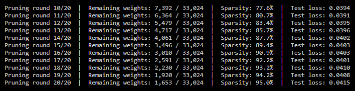
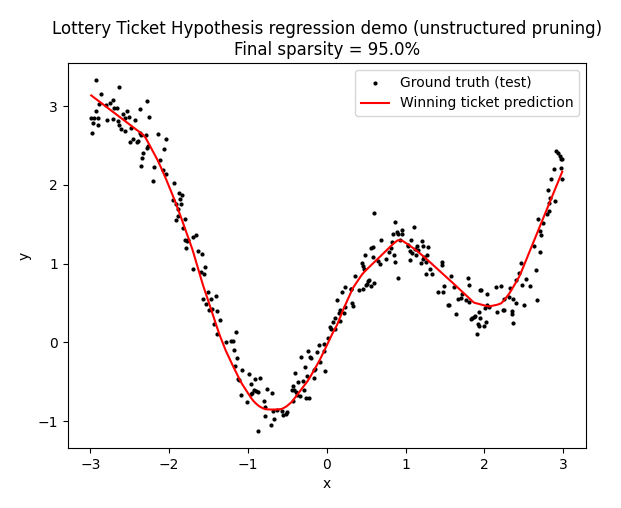
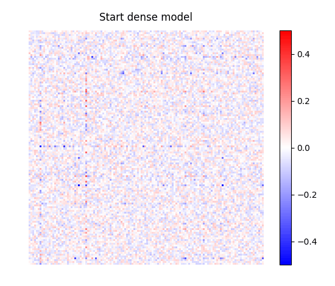
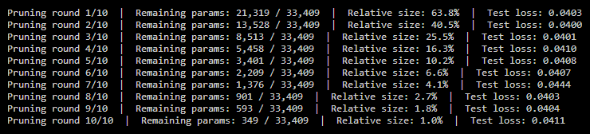
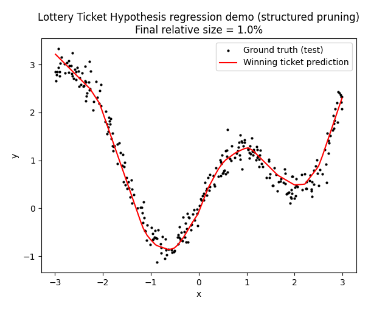
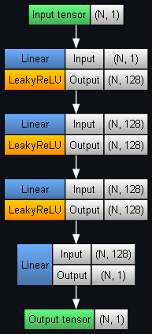
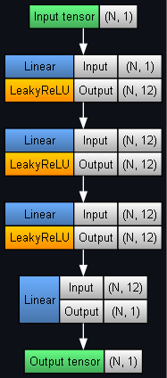

## Lottery Ticket Hypothesis

The Lottery Ticket Hypothesis states that a large, randomly initialised neural network contains much smaller subnets (called _winning tickets_) that, when trained in isolation, can achieve accuracy comparable to the full network. The challenge is finding these winning tickets. Neural network pruning is the primary technique used to do so, which is demonstrated here.

Pruning is popular because modern neural nets tend to be heavily overparameterised. For example, a network may have millions of weights, but many contribute little to the output. Pruning removes these unnecessary parameters while preserving (or minimally affecting) performance.

The two main categories are **unstructured pruning** (fine-grained) and **structured pruning** (coarse-grained).

### Unstructured pruning

Here, individual weights are removed regardless of where they are located in the network. For example, consider a weight matrix:

$$
W =
\begin{bmatrix}
0.2 & -0.8 & 0.01 \\
0.0 & 0.6 & -0.02 \\
1.1 & 0.05 & -0.9
\end{bmatrix}
$$

The original pruning algorithm removes weights with the smallest absolute values, e.g. $\lvert w \rvert < 0.1$:

$$
W =
\begin{bmatrix}
0.2 & -0.8 & 0 \\
0 & 0.6 & 0 \\
1.1 & 0 & -0.9
\end{bmatrix}
$$

The original algorithm is:

1. Randomly initialise a dense network $f$ with weights $\theta_0$.
2. Train for $j$ iterations $\rightarrow$ weights $\theta_j$.
3. Magnitude pruning: build a bitmask $m$ by setting the lowest-magnitude $p$% of weights to 0 in each layer (one-shot), or repeat train $\rightarrow$ prune for multiple rounds to reach higher sparsity (iterative).
4. Reset surviving weights to initialisation: use $m \odot \theta_0$ as the starting point. Here $\odot$ is elementwise multiplication.
5. Train the masked network $f(x|m \odot \theta_0)$ with the same data, schedule, and optimiser.
6. Declare "winning ticket" if it achieves comparable test accuracy within $j$ iterations. This network now has a sparse connectivity pattern.

We reset each subnet to the initial weights because of a central insight of the Lottery Ticket Hypothesis: experiments showed that training the sparse network from its original initialisation works much better than using a new random initialisation. This suggests that both the architecture and initial weight values are important components of a winning ticket.

Iterative pruning usually outperforms one-shot pruning, as it gives the network a chance to learn which weights matter the most before they are removed. For example, rather than removing 95% of the weights at once, you could prune ~14% for 20 rounds. This allows the network to gradually identify increasingly important connections, preserving performance better than removing a large portion in one go.

Although many weights disappear, processors still struggle to exploit this irregular sparsity efficiently, as sparse memory accesses are less hardware-friendly than dense operations. This is why the hypothesis wasn't originally proposed as a model compression technique: its goal was to answer the question _"Do large neural networks need all of their parameters to learn well?"_

The answer is no, as seen when tested on this toy dataset:

	
	 
	

This GIF shows how the weight matrix of the model's second layer changes after each pruning round (note how most weight values are set to 0 by the end):

	

### Structured pruning

The same idea applies here, but at a higher level of granularity. Rather than individual weights, this method removes entire computational structures, for instance:
- neurons
- convolutional filters
- channels
- attention heads
- entire layers.

This produces a smaller dense network that can still be run efficiently on CPUs/GPUs, which is why this approach is used for actual model compression. Similarly, iteration is often better than one-shot here, as removing many structures at once can disrupt the learned feature hierarchy. For example, if 50% of the convolutional filters are removed in an early layer, later layers receive very different feature maps and may struggle to recover. Iterative pruning allows the network to redistribute the workload among the remaining filters before further pruning.

Results when tested on the same dataset:

	
	 
	

Original dense model architecture:

	

Winning ticket architecture:

	

Source:
- [The Lottery Ticket Hypothesis: Finding Sparse, Trainable Neural Networks](https://arxiv.org/pdf/1803.03635) (Frankle, Carbin 2019)
