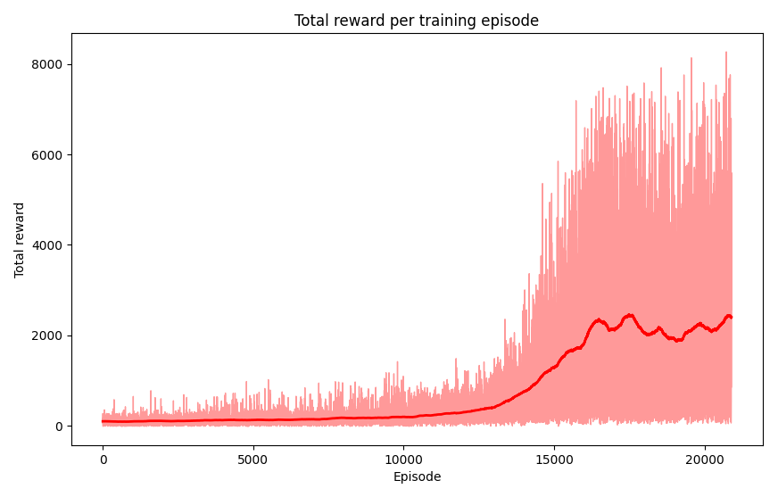

## Proximal Policy Optimisation for playing Asteroids

	

Proximal Policy Optimisation (PPO) is a policy gradient method, meaning it searches the space of policies rather than assigning values to state-action pairs like regular Q-learning methods (see [this other project](../reinforcement_learning_basics)). It uses two functions: a policy (actor) function to choose actions, and a value (critic) function to evaluate states. PPO is motivated by the same question as Trust Region Policy Optimisation (TRPO): how can we take the biggest possible improvement step on a policy without stepping so far as to accidentally cause performance collapse? TRPO aims to solve this problem with a complex second-order method; PPO is a family of first-order methods that use other tricks to keep new policies close to old ("proximal"). PPO methods are significantly simpler to implement, but empirically seem to perform at least as well as TRPO.

This graph shows the progress throughout training:

	

### Key stages of the training curve

1. Episodes 0 - 5,000 (early exploration): the agent is essentially random. Both the raw rewards and moving average hover around 0 - 200, with little variance. The policy hasn't learned anything meaningful yet and is mostly exploring the environment.
2. Episodes 5,000 - 10,000 (slow, noisy learning begins): the moving average starts to trend upwards very gradually. Raw episode rewards occasionally spike higher, but these are inconsistent. The agent is beginning to discover rewarding behaviours, but hasn't stabilised them into its policy yet.
3. Episodes 10,000 - 13,000 (inflection point / breakthrough): this is the most critical phase. The moving average climbs noticeably, and the variance in raw rewards explodes, with spikes reaching 2,000+. This suggests the agent has transitioned from mostly random / ineffective behaviour to a significantly better policy, but is applying it inconsistently.
4. Episodes 13,000 - 17,000 (rapid policy improvement): the moving average rises steeply from ~500 to ~2,000. The raw reward band is extremely wide (~0 to ~7,000), indicating that the policy is intermittently exploiting newly discovered high-reward trajectories.
5. Episodes 17,000 - 20,000+ (convergence): the moving average plateaus around 2,000 - 2,500 and oscillates rather than climbing further. The raw variance remains very high, but the policy has largely converged. The continued high variance is likely due to the environment's inherent stochasticity.

`ppo/ppo_agent.py` implements this pseudocode:

	

but with Generalised Advantage Estimation (GAE) in step 4 instead of returns-to-go. This is because GAE gives a much lower-variance estimate of the advantage, making PPO updates more stable and sample-efficient.

Rewritten policy objective to maximise (step 6):

$$L^{CLIP}(\theta)=\hat{\mathbb{E}}_t\bigg[\mathrm{min}\bigg(r_t(\theta)\hat{A}_t,\mathrm{clip}(r_t(\theta),1-\epsilon,1+\epsilon)\hat{A}_t\bigg)\bigg]$$

Where:
- $\theta$ = policy function (actor network) parameters
- $\hat{\mathbb{E}}_t$ denotes empirical expectation over timesteps

$$r_t(\theta)=\frac{\pi_\theta(a_t|s_t)}{\pi_{\theta_{\text{old}}}(a_t|s_t)}=\frac{\text{prob. of choosing action } a_t \text{ in state } s_t \text{ under current policy } \pi_\theta}{\text{prob. of choosing } a_t \text{ in } s_t \text{ under } \pi_{\theta_{\text{old}}}}$$

- $\hat{A}_t$ = expected advantage at time $t$ (computed via GAE - see below)
- $\epsilon$ is a hyperparameter (usually 0.1-0.3) for clipping, which penalises large policy updates
- $\mathrm{min()}$ enforces a [pessimistic](https://arxiv.org/pdf/2012.15085.pdf) bound on improvement.

GAE is used to compute advantages:

$$\hat{A}_t = \sum_{l=0}^\infty (\gamma \lambda)^l \delta_{t+l}^V$$

- $\gamma$ = return discount factor (0-1), which controls how much future rewards matter compared to immediate rewards
- $\lambda$ = GAE parameter (0-1), which trades off bias vs variance when estimating advantages (lower = more bias, higher = more variance)
- $\delta_t^V = r_t + \gamma V(s_{t+1}) - V(s_t)$ = temporal difference error
- $r_t$ = reward at timestep $t$
- $V(s_t)$ = value of state $s_t$.

Sources:
- [The Making Of: Asteroids](https://web.archive.org/web/20140104230826/http://www.edge-online.com/features/making-asteroids/2/)
- [High-Dimensional Continuous Control Using Generalized Advantage Estimation](https://arxiv.org/pdf/1506.02438) (Schulman et. al. 2016)
- [Proximal Policy Optimization Algorithms](https://arxiv.org/pdf/1707.06347.pdf) (Schulman et. al. 2017)
- [Spinning Up in Deep RL](https://spinningup.openai.com/en/latest/algorithms/ppo.html#exploration-vs-exploitation) (OpenAI 2018)
