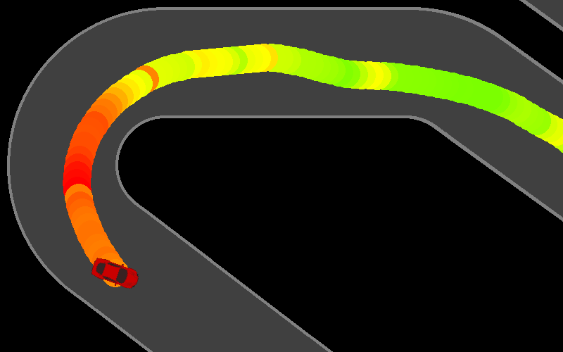
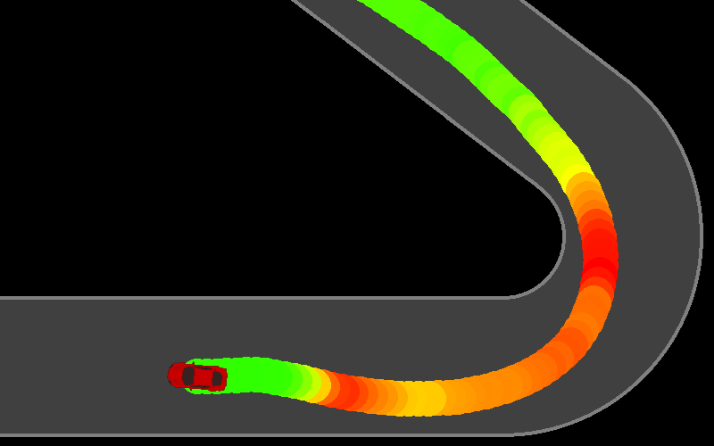
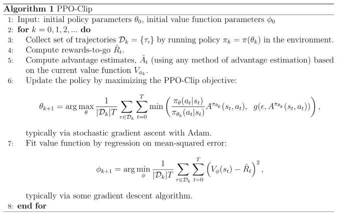

## Proximal Policy Optimisation Racecar

	

Proximal Policy Optimisation (PPO) is a policy gradient method, meaning it searches the space of policies rather than assigning values to state-action pairs like regular Q-learning methods (see [this other project](../reinforcement_learning_basics)). It uses two functions: a policy (actor) function to choose actions, and a value (critic) function to evaluate states. PPO is motivated by the same question as Trust Region Policy Optimisation (TRPO): how can we take the biggest possible improvement step on a policy without stepping so far as to accidentally cause performance collapse? TRPO aims to solve this problem with a complex second-order method; PPO is a family of first-order methods that use other tricks to keep new policies close to old ("proximal"). PPO methods are significantly simpler to implement, but empirically seem to perform at least as well as TRPO.

As the critic function outputs a real value for states, this can be rendered as a heatmap:

	

	

This reveals where the agent thinks it's "safe" or "risky", and whether it understands long-term rewards e.g. setting up corners.

`ppo/ppo_agent.py` implements this pseudocode:

	

but with Generalised Advantage Estimation (GAE) in step 4 instead of returns-to-go. This is because GAE gives a much lower-variance estimate of the advantage, making PPO updates more stable and sample-efficient.

Rewritten policy objective to maximise (step 6):

$$L^{CLIP}(\theta)=\hat{\mathbb{E}}_t\bigg[\mathrm{min}\bigg(r_t(\theta)\hat{A}_t,\mathrm{clip}(r_t(\theta),1-\epsilon,1+\epsilon)\hat{A}_t\bigg)\bigg]$$

Where:
- $\theta$ = policy function (actor network) parameters
- $\hat{\mathbb{E}}_t$ denotes empirical expectation over timesteps

$$r_t(\theta)=\frac{\pi_\theta(a_t|s_t)}{\pi_{\theta_{\text{old}}}(a_t|s_t)}=\frac{\text{prob. of choosing action } a_t \text{ in state } s_t \text{ under current policy } \pi_\theta}{\text{prob. of choosing } a_t \text{ in } s_t \text{ under } \pi_{\theta_{\text{old}}}}$$

- $\hat{A}_t$ = expected advantage at time $t$ (computed via GAE - see below)
- $\epsilon$ is a hyperparameter (usually 0.1-0.3) for clipping, which penalises large policy updates
- $\mathrm{min()}$ enforces a [pessimistic](https://arxiv.org/pdf/2012.15085.pdf) bound on improvement.

GAE is used to compute advantages:

$$\hat{A}_t = \sum_{l=0}^\infty (\gamma \lambda)^l \delta_{t+l}^V$$

- $\gamma$ = return discount factor (0-1), which controls how much future rewards matter compared to immediate rewards
- $\lambda$ = GAE parameter (0-1), which trades off bias vs variance when estimating advantages (lower = more bias, higher = more variance)
- $\delta_t^V = r_t + \gamma V(s_{t+1}) - V(s_t)$ = temporal difference error
- $r_t$ = reward at timestep $t$
- $V(s_t)$ = value of state $s_t$.

Sources:
- [High-Dimensional Continuous Control Using Generalized Advantage Estimation](https://arxiv.org/pdf/1506.02438) (Schulman et. al. 2016)
- [Proximal Policy Optimization Algorithms](https://arxiv.org/pdf/1707.06347.pdf) (Schulman et. al. 2017)
- [Spinning Up in Deep RL](https://spinningup.openai.com/en/latest/algorithms/ppo.html#exploration-vs-exploitation) (OpenAI 2018)
