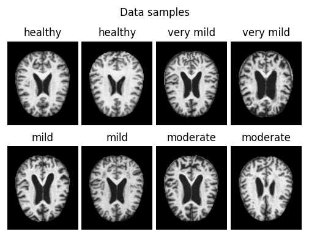
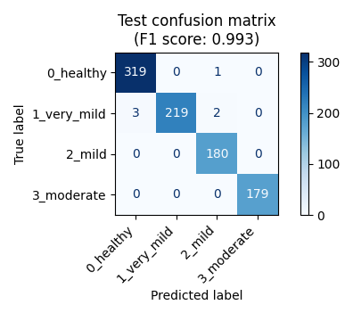
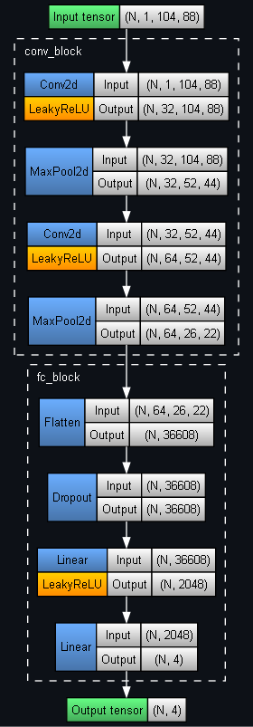

## PyTorch Brain Scan Classification for Alzheimer's Disease Detection

	
	 
	

Model architecture:

	

Sources:
- [Alzheimer's Dataset](https://www.kaggle.com/datasets/tourist55/alzheimers-dataset-4-class-of-images) (Kaggle dataset)
