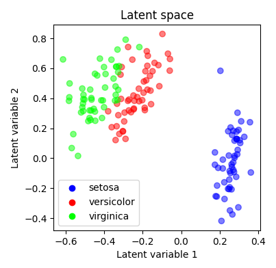
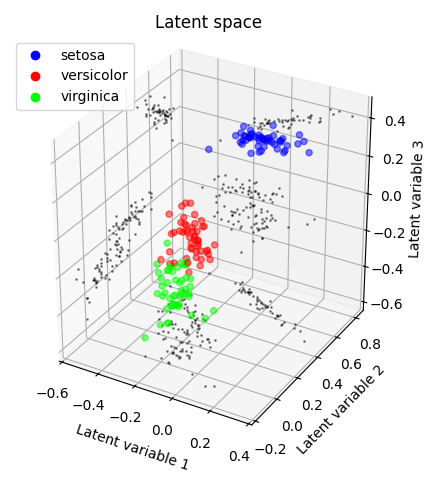

## PyTorch Autoencoder demo (on MNIST dataset or tabular data)

In the case of the MNIST autoencoder, the data dimensionality is reduced from `(1, 28, 28)` (colour channels, height, width) to `(2,)` - a compression factor of 392. These latent variables can thus be plotted on $xy$ axes:

	

MNIST autoencoder architecture:

	

Example of tabular data compression (iris dataset, 2 latent variables and 3 latent variables):

	
	 
	

