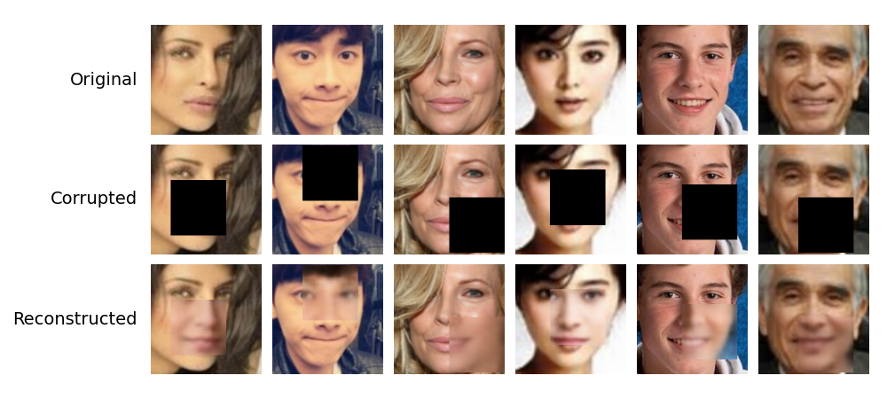

Demo of a variational autoencoder (VAE) for inpainting

Example test set outputs:

	
	

Visualising some of the latent space by linearly interpolating between 2 random noise vectors:

	

Sources:
- [From Autoencoder to Beta-VAE](https://lilianweng.github.io/posts/2018-08-12-vae/) (Weng 2018)
- [Auto-Encoding Variational Bayes](https://arxiv.org/pdf/1312.6114) (Kingma, Welling 2022)
- [UTKFace](https://www.kaggle.com/datasets/jangedoo/utkface-new) (Kaggle dataset)
