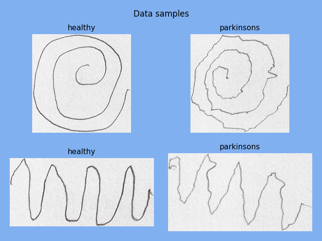
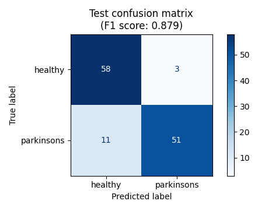
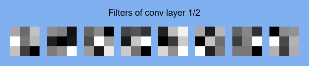
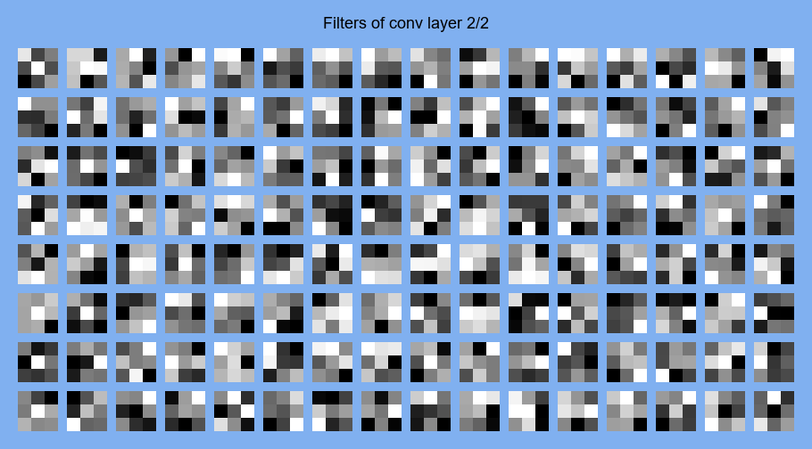
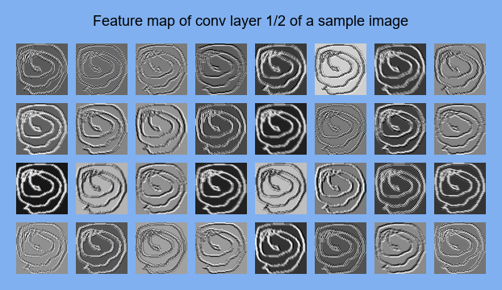
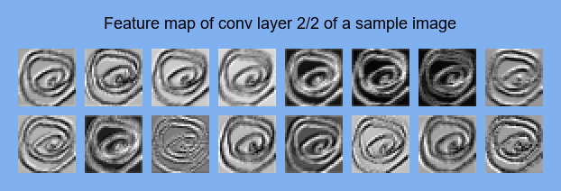
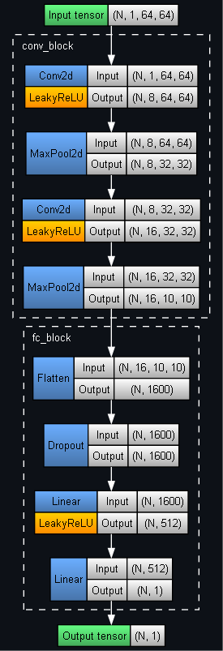

## PyTorch classification of Patient Drawings for Parkinson's Disease Detection

	
	 
	

Learned filters of each conv layer, and corresponding feature maps of a sample image:

	
	 
	
	 
	
	 
	

Model architecture:

	

Source:
- [Parkinson's Drawings](https://www.kaggle.com/datasets/kmader/parkinsons-drawings) (Kaggle dataset)
