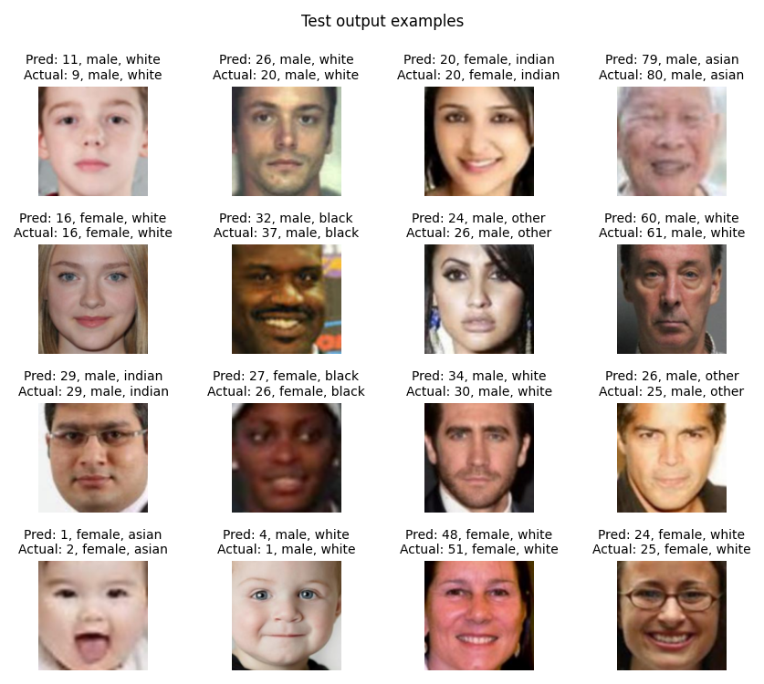

## VGG16-based PyTorch CNN for age prediction and gender/race classification of UTKFace

	

Model architecture:

	

Sources:
- [VGG16 architecture](https://medium.com/@mygreatlearning/everything-you-need-to-know-about-vgg16-7315defb5918)
- [UTKFace](https://www.kaggle.com/datasets/jangedoo/utkface-new) (Kaggle dataset)
