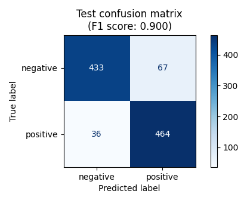
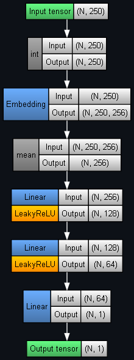

## Sentiment Analysis of Movie Reviews via an Embedding-based PyTorch model

Raw data:

	

Test set performance:

	
	 
	

Model architecture (input size = 300 tokens):

	

Sources:
- [IMDb Dataset of 50K Movie Reviews](https://www.kaggle.com/datasets/lakshmi25npathi/imdb-dataset-of-50k-movie-reviews) (Kaggle dataset)
