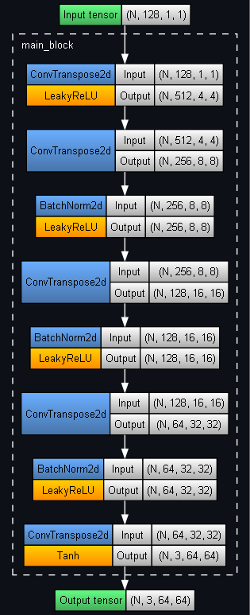
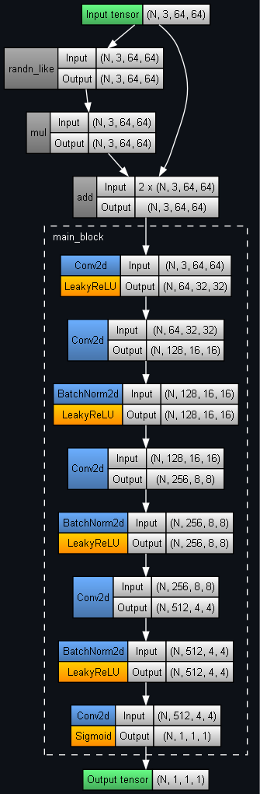

## PyTorch demo of a Deep Convolutional Generative Adversarial Network (DCGAN)

Training progress on a fixed noise vector (up to the best epoch, 8):

	

Visualising some of the latent space by linearly interpolating between 2 random noise vectors:

	

Generator architecture:

	

Discriminator architecture:

	

Source:
- [CelebA-HQ resized (256x256)](https://www.kaggle.com/datasets/badasstechie/celebahq-resized-256x256) (Kaggle dataset)
