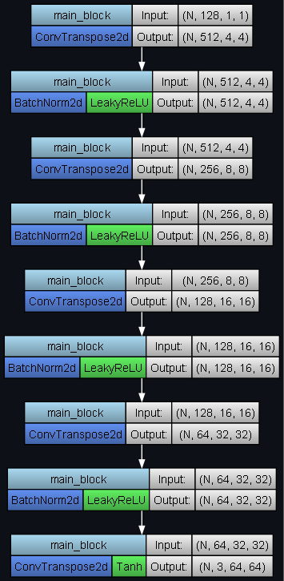
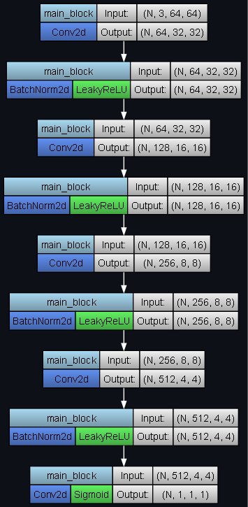

PyTorch demo of a Deep Convolutional Generative Adversarial Network (DCGAN)

Training progress on a fixed noise vector (up to the best epoch, 17):

  

Visualising some of the latent space by linearly interpolating between 2 random noise vectors:

  

Generator architecture:

Discriminator architecture:

