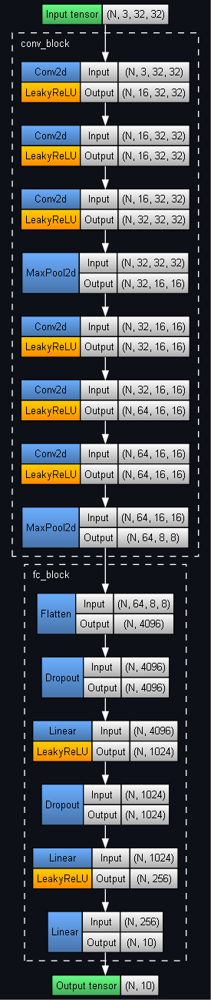
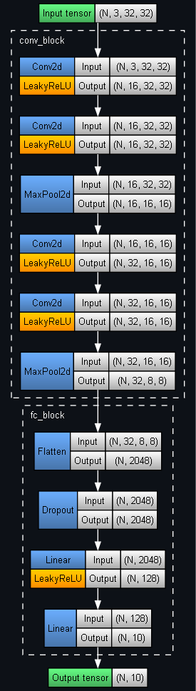

## PyTorch Knowledge Distillation demo with the CIFAR-10 dataset

|          Model          |  Test set F1 score  |
|:-----------------------:|:-------------------:|
|         Teacher         |        0.805        |
|     Student (no KD)     |        0.761        |
| **_Student (with KD)_** | **0.782** (+ 0.021) |

	

Teacher architecture (4,532,378 parameters):

	

Student architecture (280,218 parameters, 0.06x teacher):

	

Sources:
- [Distilling the Knowledge in a Neural Network](https://arxiv.org/pdf/1503.02531) (Hinton, Vinyals, Dean 2015)
- [Knowledge Distillation Tutorial](https://pytorch.org/tutorials/beginner/knowledge_distillation_tutorial.html) (PyTorch tutorial)
- [CIFAR-10](https://www.kaggle.com/datasets/swaroopkml/cifar10-pngs-in-folders) (Kaggle dataset)
