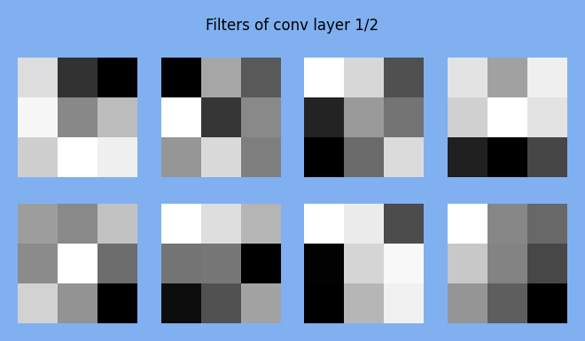
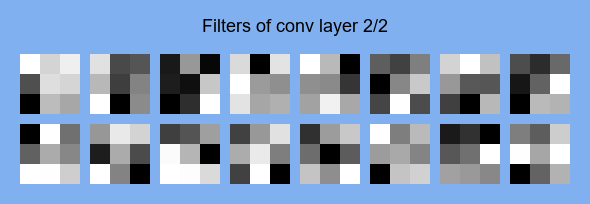
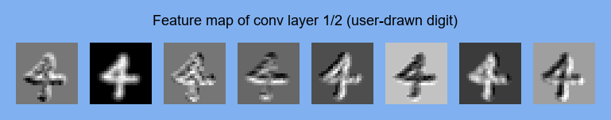
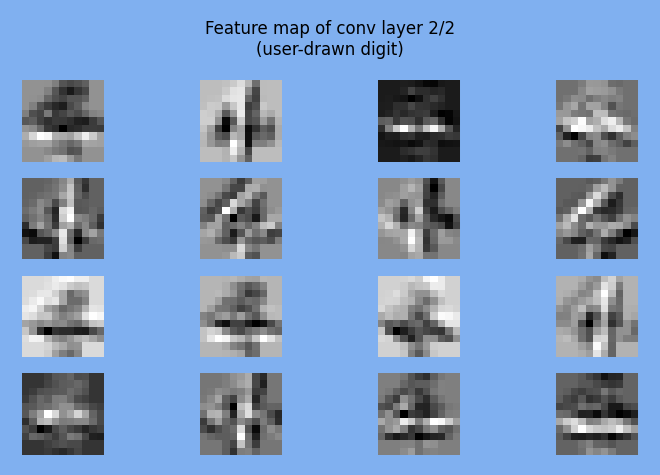

## (PyTorch) MNIST Convolutional Neural Network (CNN)

	

Learned filters of each conv layer:

	
	 
	

Test set performance:

	

Test on user-drawn digit (+ feature maps):

	
	 
	
	 
	

Model architecture:

	

