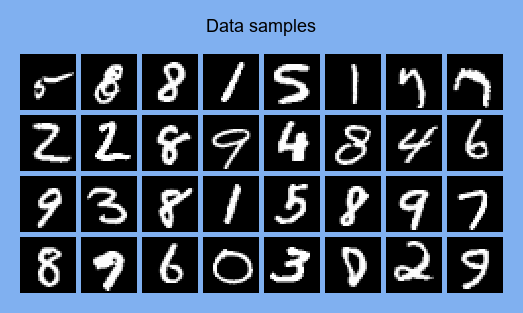
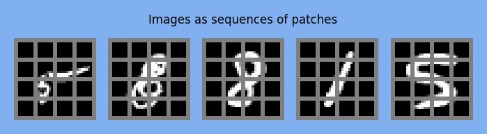
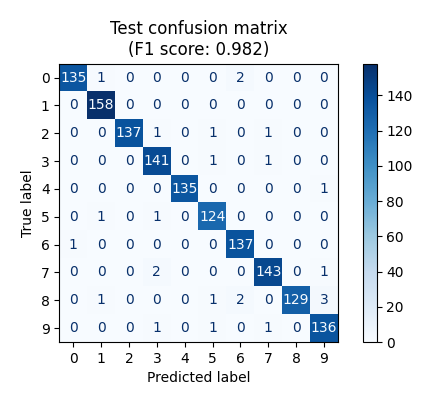
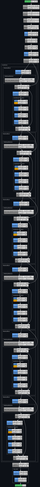

## PyTorch Vision Transformer for MNIST classification

	
	 
	

Test set performance:

	

Test on user-drawn digit (+ feature maps):

	
	 
	
	 
	

Model architecture:

	

Source:
- [Vision Transformer (ViT) Attention Maps using MNIST](https://github.com/mashaan14/VisionTransformer-MNIST/tree/main)
