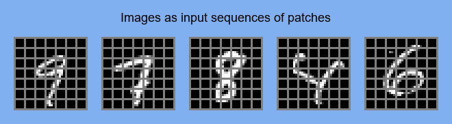
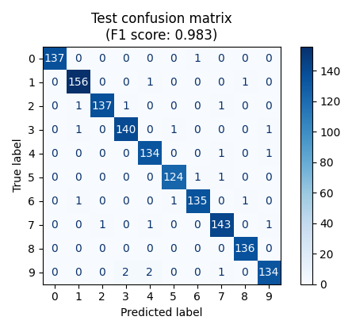
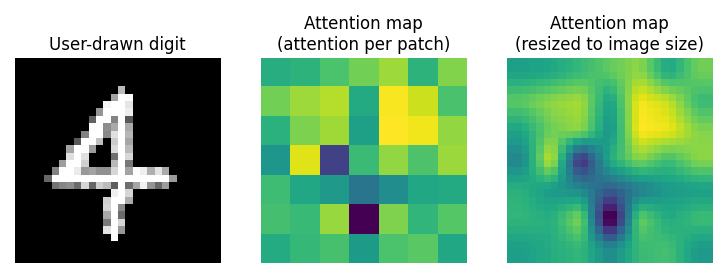
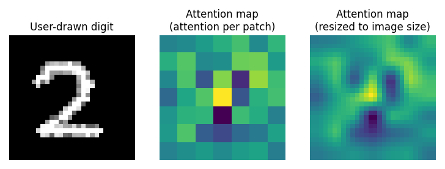
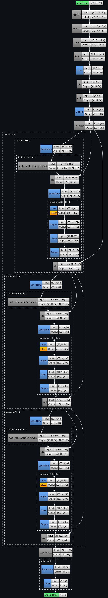

## PyTorch Vision Transformer (ViT) MNIST classifier

	
	 
	

Test set performance:

	

Attention heatmaps of first attention block on user-drawn digits:

	
	 
	

Model architecture:

	

Sources:
- [Vision Transformer (ViT) Attention Maps using MNIST](https://github.com/mashaan14/VisionTransformer-MNIST/tree/main)
- [Quantifying Attention Flow in Transformers](https://arxiv.org/pdf/2005.00928) (Abnar, Zuidema 2020)
