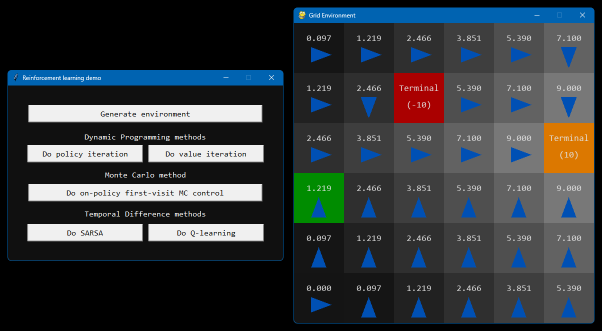

## Demo of various Reinforcement Learning algorithms

The environment is a grid world. The agent starts at a random cell, and its goal is to find gold.

Demonstrated methods:

- Dynamic programming:
	- Policy iteration
	- Value iteration
- Monte Carlo:
	- On-policy first-visit MC control
- Temporal Difference:
	- SARSA
	- Q-learning

Rewards are: +10 for finding gold, -10 for falling into hole, and -1 per timestep.

	

