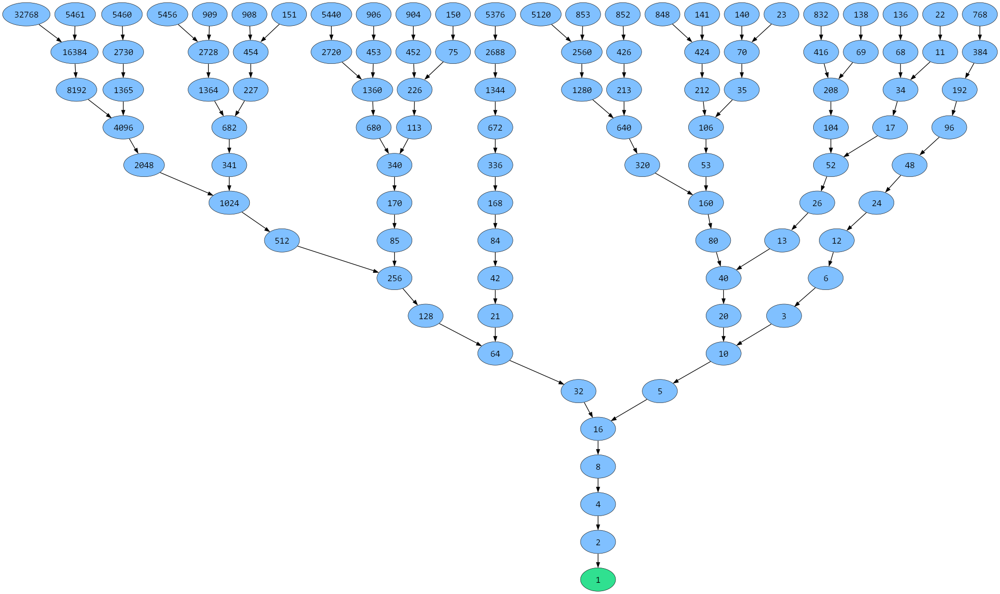
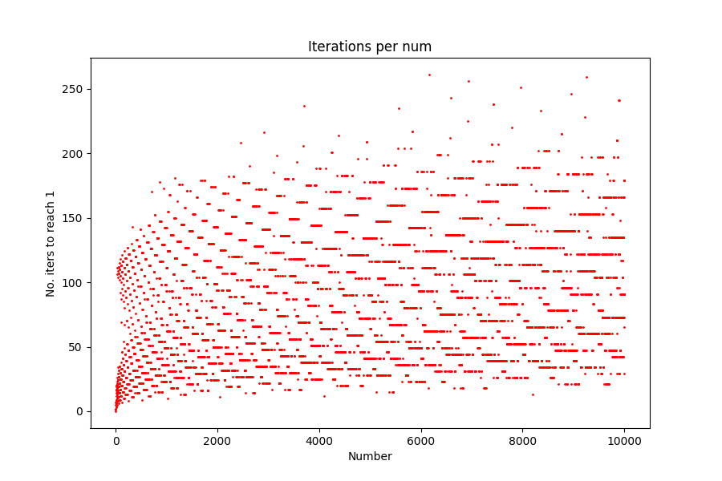
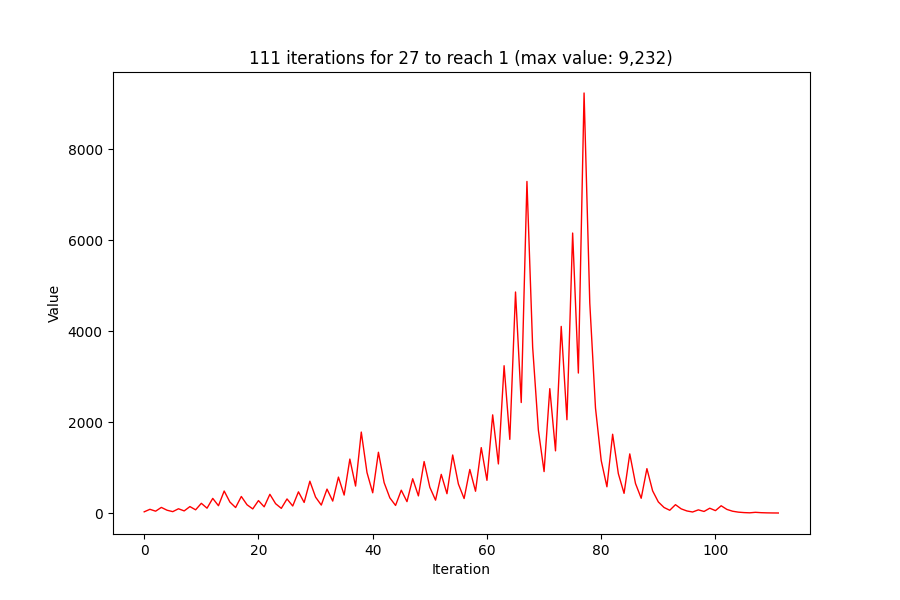

## Visualisation of the Collatz conjecture

The unsolved conjecture: given a positive integer $n$, does repeating the function

$$
f(n) =
\begin{cases}
n/2 & \text{if } n \text{ is even} \\
3n+1 & \text{if } n \text{ is odd}
\end{cases}
$$

on $n$ always eventually transform it into 1?

Graph of all numbers with trajectories $\le$ 15 steps long:

	

Iterations needed per number (1 - 10,000):

	

Trajectory of 27 (longest one for a starting number < 50):

	

