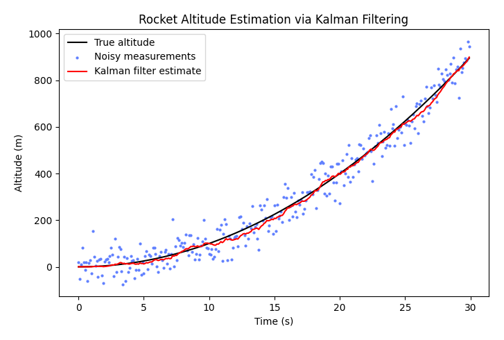

## [Kalman filter](https://en.wikipedia.org/wiki/Kalman_filter) demo

	

### Explanation

|   
Variable
    | 
Description
                                                                                                                                                |
|:--------------------------------------------:|:------------------------------------------------------------------------------------------------------------------------------------------------------------------------------------------|
|          State vector $\mathbf{x}$           | A $2 \times 1$ vector representing the rocket's state, defined by its altitude and velocity (here we're only measuring altitude).                                                     |
|     State transition matrix $\mathbf{F}$     | This matrix models how the state evolves over time. Since the altitude changes by velocity, and velocity by acceleration, the state transition matrix includes the timestep $dt$. |
|       Measurement matrix $\mathbf{H}$        | We're only measuring altitude (not velocity), so the measurement matrix $\mathbf{H} = [[1, 0]]$                                                                                       |
|     State covariance matrix $\mathbf{P}$     | Represents uncertainty in state estimates.                                                                                                                                                |
| Process noise covariance matrix $\mathbf{Q}$ | Represents uncertainties in the model itself (e.g. imperfections in the constant acceleration assumption).                                                                            |
|  Measurement covariance matrix $\mathbf{R}$  | Represents the measurement noise covariance (influenced by the noise in the altitude measurements).                                                                                   |

For each noisy measurement $z$:

1. Prediction step: predict the rocket's next state based on the current state
   * State prediction: $\mathbf{x} = \mathbf{F} \mathbf{x}$
   * Covariance prediction: $\mathbf{P} = \mathbf{F} \mathbf{P} \mathbf{F}^{\top} + \mathbf{Q}$
2. Update step: corrects the prediction using the noisy measurement
   * Measurement residual (innovation): $\mathbf{y} = z - \mathbf{H} \mathbf{x}$
   * Innovation covariance: $\mathbf{S} = \mathbf{H} \mathbf{P} \mathbf{H}^{\top} + R$
   * Kalman gain: $\mathbf{K} = \mathbf{P} \mathbf{H}^{\top} \mathbf{S}^{-1}$
   * State update: $\mathbf{x} = \mathbf{x} + \mathbf{K} \mathbf{y}$
   * Covariance update: $\mathbf{P} = \mathbf{P} - \mathbf{K} \mathbf{H} \mathbf{P}$

Sources:
- [Kalman Filter Explained Simply](https://thekalmanfilter.com/kalman-filter-explained-simply/) (Franklin 2020)
- [Kalman Filter Python Example](https://thekalmanfilter.com/kalman-filter-python-example/) (Franklin 2021)
