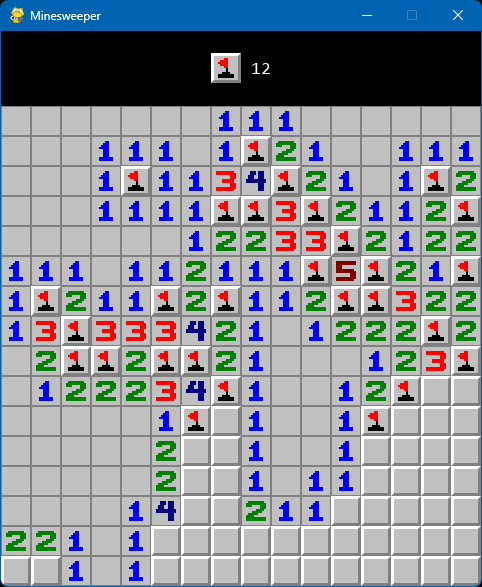

## Minesweeper and Probabilistic AI Solver

Human gameplay (intermediate difficulty):

	

AI solution showing mine probabilities (expert difficulty):

	

How `calculate_mine_probs()` works in `solver.py`:
1. Compute the edge count for each open cell (an edge is a closed cell that neighbours at least 1 open cell)
2. Run `rule1()` which computes mine probabilities around isolated open cells (e.g. if there's a `1` with 8 surrounding edges, each edge cell gets a prob of 1/8 = 12.5%)
3. Repeatedly run `rule2()`, `rule3()`, and `rule4()` until no further 0% / 100% mine probs can be deduced
4. For any remaining edges with unknown mine probabilities, generate all possible configurations of mine/non-mine for these edges, given the numbers in adjacent open cells. Then, use combinatorics to work out the final probs.

Source for `rule4()`:
- [Solving Minesweeper with Matrices](https://massaioli.wordpress.com/2013/01/12/solving-minesweeper-with-matricies/) (Massaioli 2013)
