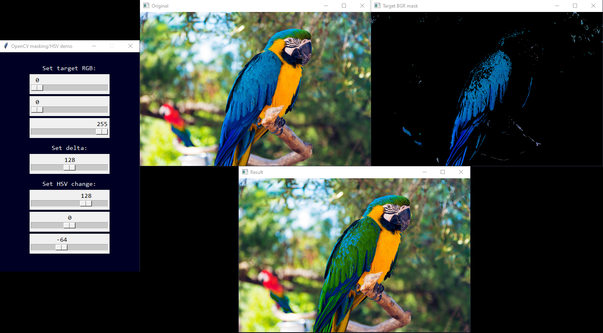

OpenCV masking/HSV demo

Top left: original image

Top right: image after mask is applied (created using `target RGB = (0, 0, 255)` and `delta = 128` to yield a lower target RGB range of `(0, 0, 127)` and upper range of `(128, 128, 255)`)

Bottom: image after applying HSV (hue, saturation, value/luminosity) changes (`+128, +0, -64`)

