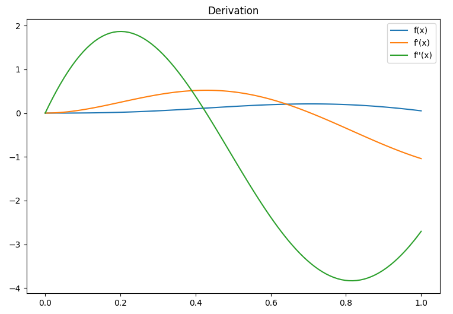
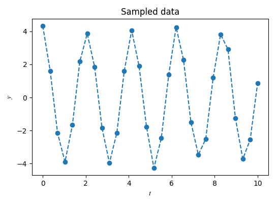
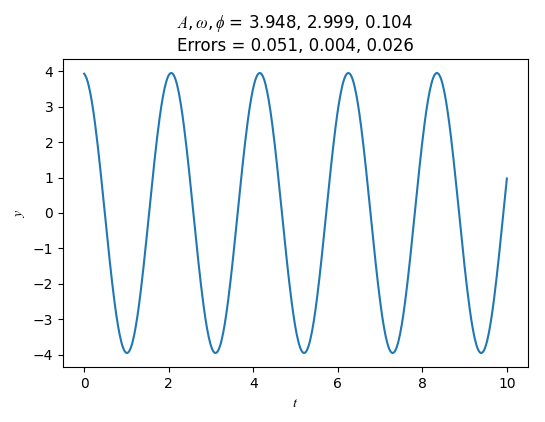
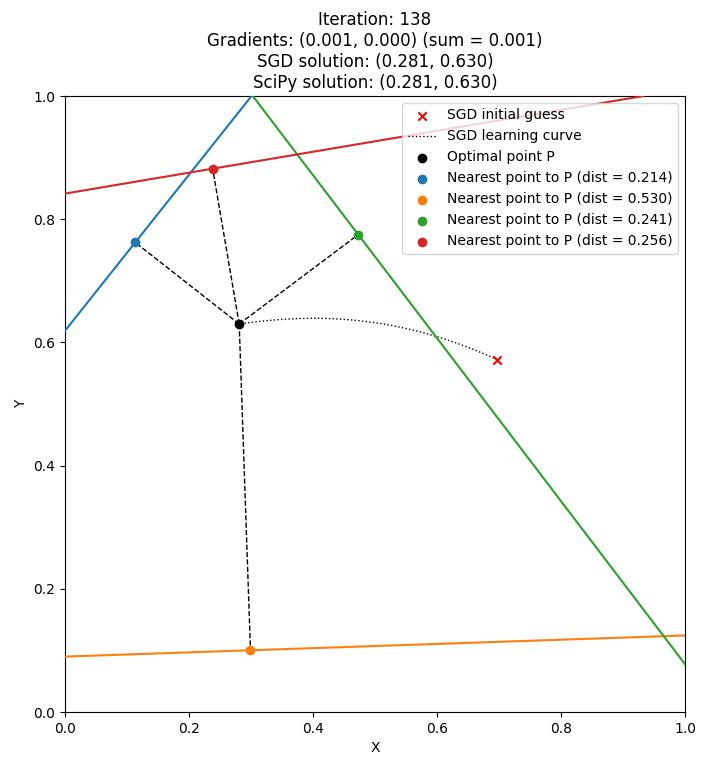

SciPy demo

### Optimisation:

E.g. Minimise $f(x,y) = (x-1)^2 + (y-2.5)^2$ subject to: 
$x-2y+2 >= 0$ 
$-x-2y+6 >= 0$ 
$-x-2y+2 >= 0$ 
$x,y >= 0$

Solution ( $(x,y)=(1.4,1.7)$ ):

	

### Interpolation:

	

### Derivation:

	

### Integration:

	

### Curve fitting:

	
	

### Minimising the distances from a point to multiple lines via Stochastic Gradient Descent:

	

