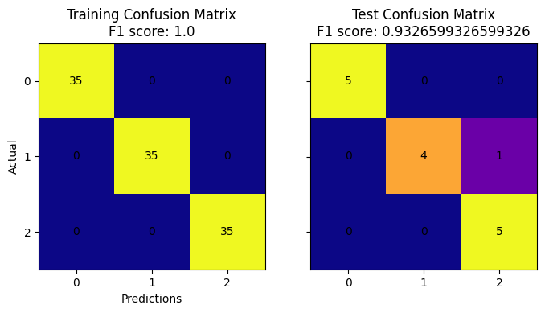

(TensorFlow) Neural network demo for binary classification, multiclass classification, or regression

Example performance of iris dataset classification:

Corresponding topology of iris classifier:

