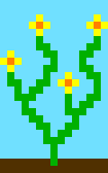
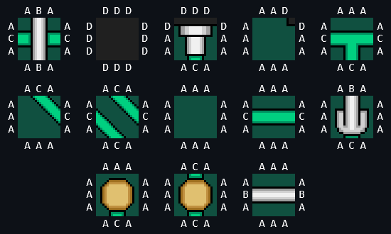
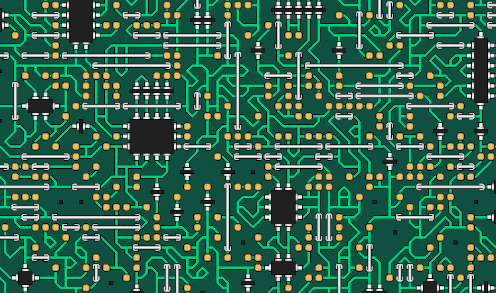

## [Wave Function Collapse](https://en.wikipedia.org/wiki/Wave_function_collapse) for image/texture generation

There are two primary tiling approaches in WFC image generation:

<h3 align="center">Overlapping tiling</h3>

	This method takes a sample image as input, and extracts small overlapping patches (tiles) of a fixed size from it. When generating an output, the algorithm ensures that each tile overlaps with its neighbours in a way that matches the samples. For example, if 3x3 tiles are extracted from a source image, each new tile placement ensures an overlap of 2 pixels with existing neighbour tiles. The rules governing which tiles can be placed in certain positions are updated after each placement, and propagated throughout the output grid via the WFC algorithm, reducing the number of valid tile possibilities (states) for neighbour cells. This process continues until each grid cell is reduced to only one possible state (its wave function is 'collapsed').

Example of generated output for `flowers.png`:

| Source                                            | Extracted 3x3 tiles                              | Generated output                                  |
|---------------------------------------------------|--------------------------------------------------|---------------------------------------------------|
|  |  |  |

Outputs for other source images:

| Source                                            | Generated output                                  |
|---------------------------------------------------|---------------------------------------------------|
|   |   |
|     |     |
|  |  |
|  |  |
|    |    |

<h3 align="center">Adjacent tiling</h3>

	Instead of extracting overlapping tiles from a source image, this approach uses an input set of tiles with predefined adjacency rules (e.g. north, east, south, west edge colour codes). When generating an output, the algorithm places tiles so that any adjacent pair obey these edge constraints (e.g. north edge colour codes of one tile must match the flipped south codes of the tile above it). As usual, the adjacency rules are then propagated throughout the output grid via WFC, and this process continues until all cells are left with one tile.

Example output from `circuit` tiles and their N/E/S/W codes:

	
	 
	

Example output from `pipes` tiles:

	

Example output from `water` tiles:

	

Source:
- https://github.com/mxgmn/WaveFunctionCollapse
